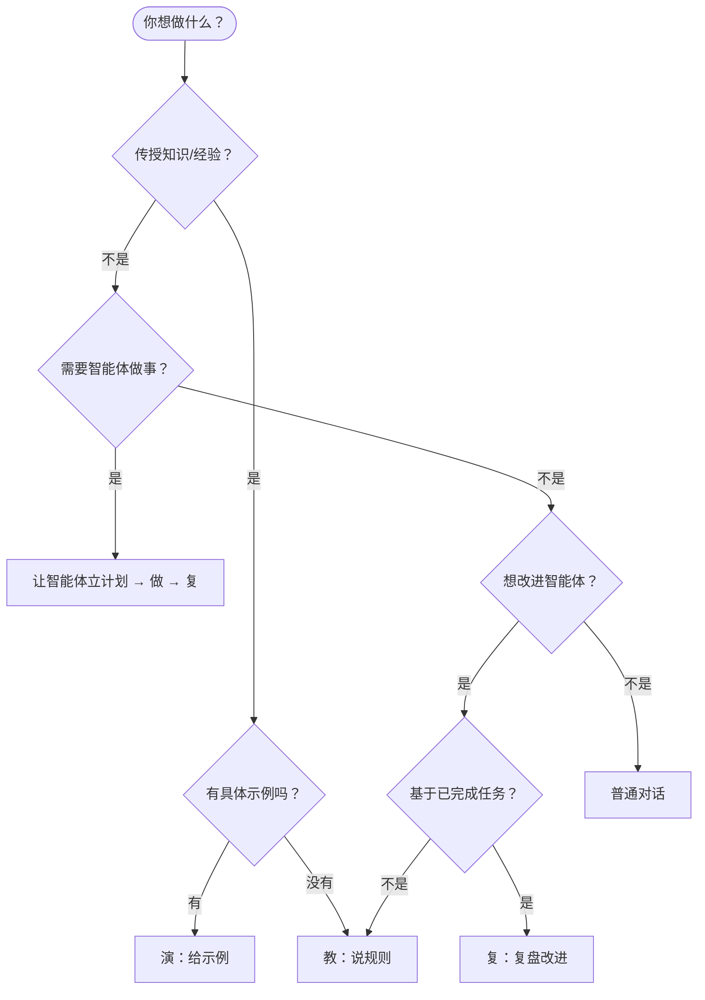

# 六原语完整指南

DesireCore 的所有交互都建立在六个基本原语之上。理解它们，就掌握了与智能体协作的核心方法。

## 六原语总览

| 原语 | 动词 | 谁发起 | 含义 |
|------|------|--------|------|
| **教（Teach）** | 告诉 | 你 | 告诉智能体怎么做、为什么这么做、什么情况例外 |
| **演（Demonstrate）** | 示范 | 你 | 给智能体看示例、反例、历史材料，让它模仿和归纳 |
| **问（Clarify）** | 追问 | 智能体 | 智能体主动追问缺失的信息，补齐任务条件 |
| **立（Plan）** | 计划 | 智能体 | 智能体给出计划、拆解步骤、标注风险点和确认点 |
| **做（Execute）** | 执行 | 智能体 | 在允许的权限和边界内行动、调用工具、推进任务 |
| **复（Reflect）** | 复盘 | 智能体 | 提交回执、复盘偏差、把新经验写回行为手册 |

## 用一个完整场景理解六原语

让我们通过一个真实场景——**教智能体审查采购合同**——来串讲这六个原语是如何协作的。

### 第一步：教（Teach）——告诉它规则

你先把审合同的核心规则教给智能体：

```
你："审采购合同的时候，重点关注以下几点：
    1. 违约金不能超过合同金额的 20%
    2. 付款周期不能少于 30 天
    3. 质保期不能少于 12 个月
    4. 如果是进口设备，必须要有中文说明书的条款"
```

智能体会把这些规则记录下来，形成可执行的行为规范。

### 第二步：演（Demonstrate）——给它看示例

光有规则还不够，你再给它看一份你之前审过的合同：

```
你："我给你看一份之前审过的合同。注意第 8 条，这里写的
    '违约金为合同金额的 50%'，这就是典型的高风险条款。
    当时我标记为'强烈建议修改'，并建议改为'不超过 20%'。"
```

通过具体的示例，智能体学会了不仅"知道规则"，还"知道怎么应用规则"。

### 第三步：问（Clarify）——它主动追问

当你委派一个审合同的任务时，智能体发现信息不够，会主动追问：

```
智能体："我注意到这份合同涉及进口设备，但没有注明原产国。
        请问：
        1. 对于不同原产国的设备，审核标准有差异吗？
        2. 是否需要额外检查出口管制相关条款？"
```

这比闷头做然后交给你一份错误的结果好得多。

### 第四步：立（Plan）——它制定计划

智能体理解了任务后，会先给你一份执行计划：

```
智能体："我计划按以下步骤审查这份合同：

        1. [固化步骤] 检查违约金比例 → 与 20% 红线对比
        2. [固化步骤] 检查付款周期 → 与 30 天底线对比
        3. [固化步骤] 检查质保期 → 与 12 个月底线对比
        4. [灵活步骤] 分析进口设备相关条款
        5. [灵活步骤] 综合评估合同风险等级
        6. [人闸门] 生成审查报告，等待你确认后发送给对方

        是否按此计划执行？"
```

:::info 什么是固化、灵活、人闸门？
- **固化步骤**：规则明确，结果确定，像程序一样执行
- **灵活步骤**：需要 AI 理解和判断的部分
- **人闸门**：必须经过你确认才能继续的关键节点

详见 [执行监控](../04-delegation/03-execution-monitoring.md)。
:::

### 第五步：做（Execute）——它执行任务

你确认计划后，智能体开始逐步执行。你可以实时看到每一步的进展：

```
智能体：
  [步骤 1/6] 检查违约金比例...
  ✅ 第 8 条：违约金 15%，符合要求

  [步骤 2/6] 检查付款周期...
  ⚠️ 第 5 条：付款周期 15 天，低于 30 天底线，标记为风险

  [步骤 3/6] 检查质保期...
  ✅ 第 12 条：质保期 24 个月，符合要求

  [步骤 4/6] 分析进口设备条款...
  ⚠️ 未发现中文说明书条款，建议补充

  [步骤 5/6] 综合风险评估...
  📊 整体风险等级：中等（2 项需关注）

  [步骤 6/6] 等待你确认审查报告...
```

### 第六步：复（Reflect）——它复盘总结

任务完成后，智能体会提交回执并复盘：

```
智能体："审查完成，回执如下：

        【审查结果摘要】
        - 2 项风险：付款周期过短、缺少中文说明书条款
        - 4 项合规
        - 建议修改 2 处条款

        【学习收获】
        这次审查中我注意到：进口设备合同中，中文说明书条款
        容易被遗漏。建议将'检查中文说明书条款'提升为固化
        步骤（自动检查），而不是灵活步骤。

        是否要把这个经验更新到审查规则中？"
```

## 六原语的循环

六个原语不是一次性的，它们构成一个持续优化的循环：

```
  教(Teach) → 演(Demonstrate)
      ↑                ↓
  复(Reflect)      问(Clarify)
      ↑                ↓
  做(Execute) ← 立(Plan)
```

每一次循环，智能体都会变得更可靠。你教的规则越多、给的示例越丰富，它处理任务的能力就越强。

## 什么时候用哪个原语



:::tip 小技巧
你不需要刻意去"使用"某个原语。就像跟同事说话一样自然地表达，智能体会自动识别你的意图。当你说"记住，以后都这样做"，它知道这是在"教"；当你说"看这个例子"，它知道这是在"演"。
:::

## 深入了解每个原语

接下来的章节会详细介绍最常用的原语：

- [教规则（Teach）](./03-teach-rules.md) —— 如何教出有效的规则
- [给示例（Demonstrate）](./04-demonstrate.md) —— 如何通过示例加速学习
- [学习反馈](./05-learning-feedback.md) —— 如何确认智能体学对了
- [撤销与遗忘](./06-undo-forget.md) —— 如何纠正错误的学习
