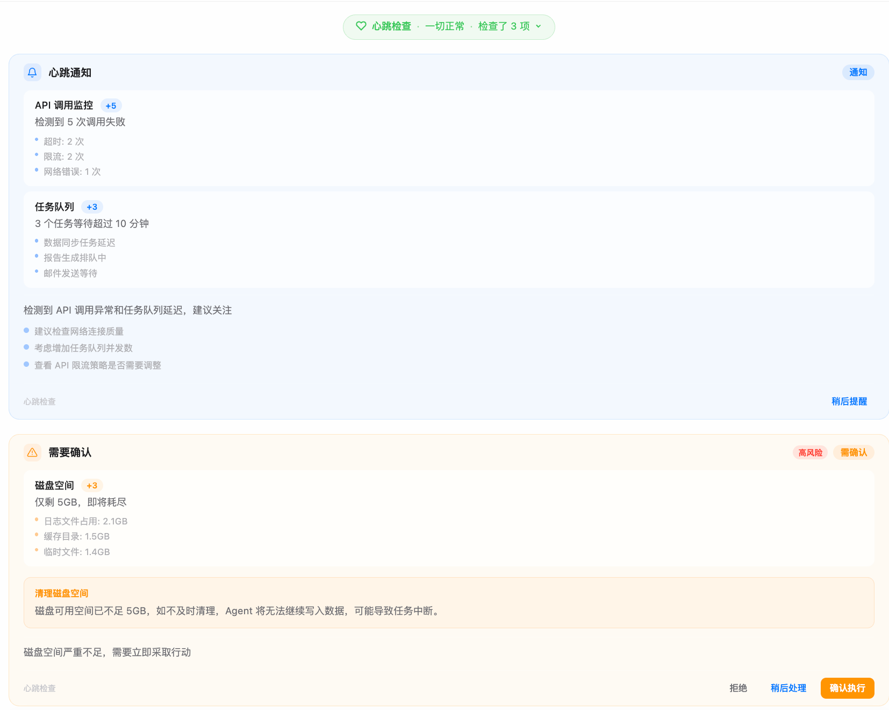
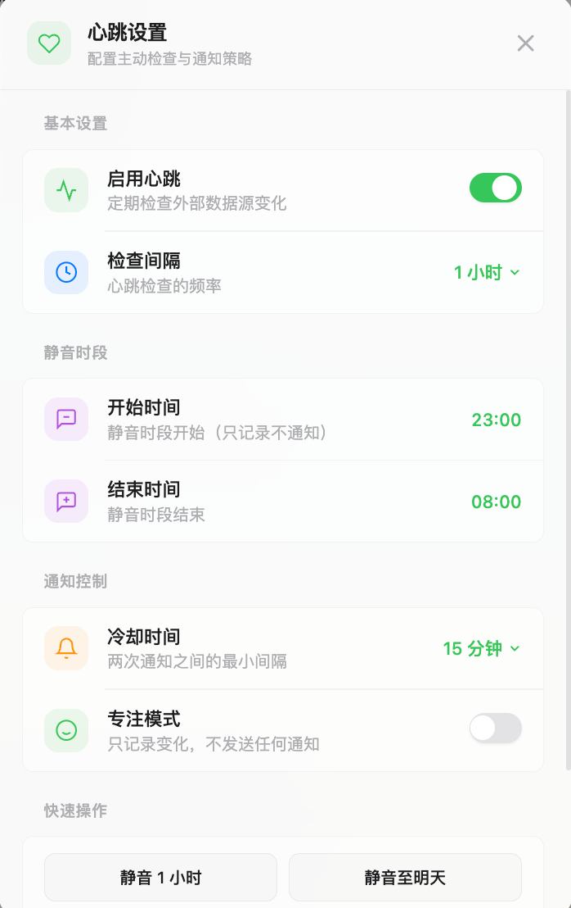
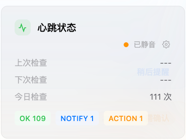
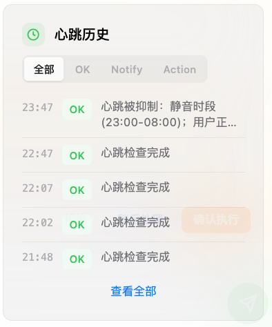

# 心跳监控

传统的 AI 助手只会被动等待你的指令。DesireCore 的智能体则不同——它们可以**主动巡检**外部环境，发现变化时**克制地通知你**。这个能力的核心就是心跳系统（Heartbeat System）。

## 什么是心跳

心跳，就是智能体定期"睁开眼睛看一看"的过程。就像值班保安每隔一段时间巡视一圈一样，智能体会按照设定的频率检查它关注的数据源，然后决定要不要告诉你。

每次心跳的流程：

1. **检查数据源** — 扫描邮箱、GitHub、日历等已连接的服务
2. **判断变化** — 对比上次检查的状态，识别有没有新内容
3. **决定响应** — 根据变化的重要程度，选择静默、通知还是请求操作

## 三级响应

心跳检查的结果分为三个级别，每个级别有不同的行为：

### OK — 一切正常

当所有数据源都没有变化时，智能体会静默记录一条检查回执，**不打扰你**。

在对话中，OK 级的结果会以一个绿色的可折叠药丸显示（如"心跳检查 · 一切正常 · 检查了 3 项"），点击可以展开查看每个数据源的检查摘要。

### Notify — 有新消息

当检测到变化但不需要你立即采取行动时，智能体会发送一条**信息通知**。

比如："收到 3 封新邮件，GitHub 上 PR #42 有新评论，下午 2 点有项目周会。"

通知卡片会展示每个数据源的变化详情、结论和建议。你可以：
- 立即查看详情
- 点击**稍后提醒**（Snooze），选择 15 分钟、1 小时或 3 小时后再次提醒

### Action — 需要你的确认

当检测到需要你亲自决策或执行外部操作的变化时，智能体会发送**操作请求**。

比如："CEO 发来邮件，需要你在下班前回复预算确认。"

操作请求会显示：
- 需要执行的操作描述
- 操作的风险等级（低风险 / 中风险 / 高风险）
- 你的选择：**拒绝** / **稍后处理** / **确认执行**

:::warning 安全第一
需要执行外部操作的请求**永远不会跳过你的确认**。智能体不会擅自发送邮件、审批 PR 或执行任何有实际影响的操作。
:::

## 配置巡检

你可以在心跳设置面板中配置巡检行为。

### 巡检频率

你可以调整智能体检查数据源的频率，系统提供三个预设间隔：

- **15 分钟** — 适合需要及时响应的场景
- **30 分钟** — 适合一般性监控
- **1 小时** — 适合不紧急的场景

:::info 最短间隔
系统强制最短巡检间隔为 15 分钟，无法设置更短的间隔。
:::

### 数据源开关

每个智能体可能连接了多个数据源。你可以针对每个数据源单独开启或关闭巡检：

- **邮箱检查** — 开启/关闭
- **GitHub 检查** — 开启/关闭
- **日历检查** — 开启/关闭

:::info 能添加新数据源吗
目前，你只能启用或禁用智能体预定义的数据源。添加新的数据源需要通过安装相应的工具或 MCP 服务来实现。
:::

## 静音策略

智能体虽然会主动通知，但它也懂得"克制"。系统提供五种静音策略，按以下顺序依次检查：

| 策略 | 说明 | 默认值 |
|------|------|--------|
| **临时静音（Snooze）** | 暂时屏蔽通知，到点恢复 | 关闭 |
| **专注模式（Focus Mode）** | 全面静音，所有级别均不推送 | 关闭 |
| **安静时段（Quiet Hours）** | 在此时间段内不执行心跳 | 23:00 - 08:00 |
| **通知冷却（Cooldown）** | 两次通知之间的最短间隔 | 15 分钟 |
| **忙碌信号（Busy Signal）** | 检测到你正在对话时，暂缓推送通知 | 开启 |

任意一条策略命中即抑制通知。但不同策略的抑制行为有所不同：

**前四种是硬抑制**——命中时心跳检查（包括 LLM 查询）会被完全跳过，仅生成一条标记为"已抑制"的回执。这样可以节省计算资源。

**忙碌信号是软抑制**——心跳检查照常执行，但通知推送会被暂缓。当你正在与智能体进行实时对话时，系统认为你正在专注处理事务，等对话结束后抑制自动解除。

### 安静时段

安静时段支持跨午夜设置（如 23:00 - 08:00 表示晚上 11 点到次日早上 8 点），并完全尊重你配置的时区。

安静时段结束后的第一次心跳会自动进入**合并汇报模式**：系统检测到当前时间距安静时段结束不超过一个检查间隔时，会在心跳上下文中注入特殊指令，要求智能体对安静期间可能积累的所有变化进行全面、综合的检查和汇报，而不是只报告最近的增量变化。

### 专注模式

开启后所有心跳只记录不通知，直到手动关闭。

### 冷却时间

冷却时间可选预设：15 分钟、30 分钟、1 小时。冷却机制适用于所有通知级别，不区分级别。

### 快速静音

在心跳设置面板中，你可以快速启用临时静音：
- **静音 1 小时** — 立即开始，1 小时后自动恢复
- **静音到明天 8:00** — 从现在起一直静音到次日早上 8 点

## 查看巡检结果

在智能体详情页中，心跳监控面板由两张卡片组成：**心跳状态卡片**和**心跳历史卡片**。当心跳未启用时，面板不会显示。

### 心跳状态卡片

心跳状态卡片实时展示当前的巡检状态，包含以下信息：

- **运行状态指示** — 右上角的彩色圆点和标签，反映当前心跳状态：
  - 绿色圆点 + "活跃"：心跳正常运行
  - 橙色圆点 + 具体原因：心跳被抑制（显示"已静音"、"专注模式"、"安静时段"或"已抑制"）
- **上次检查** — 上一次心跳执行的相对时间（如"3 分钟前"）
- **下次检查** — 下一次预计执行的相对时间（根据上次检查时间 + 检查间隔计算）
- **今日检查** — 当天已执行的心跳总次数
- **状态分布** — 当天各级别结果的统计，以彩色标签显示：
  - 绿色标签 `OK` — 一切正常的次数
  - 蓝色标签 `NOTIFY` — 发送通知的次数
  - 橙色标签 `ACTION` — 请求操作的次数

### 心跳历史卡片

心跳历史卡片展示最近的心跳回执记录，支持按级别筛选。

**筛选标签** — 顶部提供四个筛选标签页：

| 标签 | 说明 |
|------|------|
| **全部** | 显示所有级别的回执 |
| **OK** | 仅显示一切正常的回执 |
| **Notify** | 仅显示发送了通知的回执 |
| **Action** | 仅显示请求了操作的回执 |

**回执记录** — 每条回执显示：

- 执行时间（HH:MM 格式）
- 级别标签（彩色，如绿色 `OK`、蓝色 `NOTIFY`、橙色 `ACTION`）
- 结论摘要（最多两行）
- 操作决策标记（仅 Action 级）：绿色 ✓ 表示已批准，红色 ✗ 表示已拒绝

默认显示最近 5 条记录，点击底部的**展开更多**可查看全部回执（最多加载 50 条）。

:::tip 可追溯
每次心跳检查都会生成一条不可篡改的回执（Receipt），确保智能体的所有行为可追溯、可审计。即使检查被静音策略抑制，回执同样会被记录（标记为 `suppressed: true`），保证审计链的完整性。
:::

## 瞬态错误处理

心跳系统内置了智能重试机制。当连接数据源时遇到瞬态错误（如网络超时、服务限流、服务器临时不可用等），系统会自动重试，间隔依次为 2 秒、5 秒和 15 秒，最多尝试 3 次。如果所有重试均失败，此次心跳会被标记为错误状态并记录失败原因，但**不会影响后续心跳的正常调度**。
