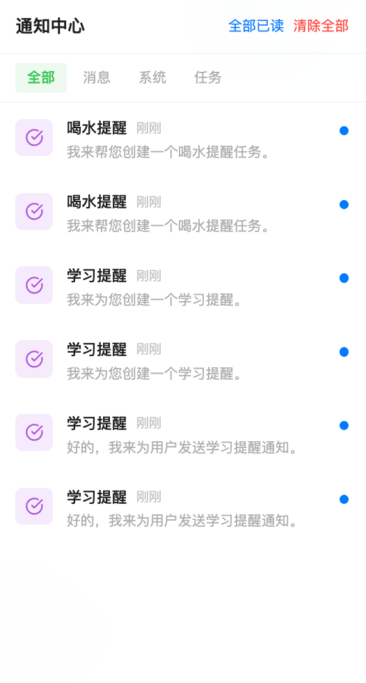

# 通知管理

智能体需要在合适的时机把重要的信息传达给你。DesireCore 提供了通知中心和桌面通知两种机制，确保重要的消息不被错过，同时避免不必要的打扰。

## 通知分类

DesireCore 的通知按来源分为三个类别：

### 消息通知

来自智能体的对话消息通知。

- **图标**：蓝色铃铛
- **场景**：智能体在对话中发送了新消息

### 系统通知

来自系统层面的通知。

- **图标**：绿色信息图标
- **来源**：心跳检查失败、定时任务执行失败、测试通知等
- **场景**：智能体的心跳检查出现错误、定时任务执行报错

### 任务通知

来自定时任务的完成通知。

- **图标**：紫色勾选图标
- **来源**：定时任务成功执行后的结果
- **场景**：每日早报生成完毕、定时查询返回了结果

:::info 心跳结果不通过通知中心推送
心跳检查的结果（OK / Notify / Action 三个级别）直接以卡片形式插入到智能体的对话流中，不会写入通知中心。只有心跳检查**失败**（如网络错误、服务异常）时，才会以系统通知的形式推送到通知中心。详见[心跳监控](./01-heartbeat.md)。
:::

## 通知中心

点击左侧导航栏底部的**铃铛图标**即可打开通知中心。当有未读通知时，铃铛上会显示红色角标和未读数量（超过 99 条时显示为红色圆点）。

通知中心从屏幕右侧滑入，包含：

- **顶部操作栏** — 标题"通知中心"，以及"全部已读"和"清除全部"两个快捷操作
- **分类筛选** — 四个标签页：全部 / 消息 / 系统 / 任务
- **通知列表** — 按时间倒序排列，最新的通知在最前面

每条通知显示：
- 分类图标（带颜色标识）
- 通知标题
- 相对时间（如"刚刚"、"3 分钟前"、"2 小时前"）
- 通知正文（最多显示两行）
- 未读指示（蓝色圆点）

点击通知可以标记为已读。按 **ESC** 键或点击空白区域可关闭通知中心。

:::info 存储上限
通知中心最多保存 200 条通知。超出上限时，系统会优先清理最旧的已读通知；如果所有通知都未读，则清理最旧的通知。
:::

## 桌面通知

当应用窗口不在前台时，DesireCore 可以通过操作系统的原生通知弹窗提醒你。

桌面通知包含：
- 智能体名称（作为通知标题）
- 消息预览（最多 100 个字符）
- 点击通知可以跳转回应用并聚焦窗口

:::info Web 环境
在浏览器中使用时，首次开启桌面通知需要授予浏览器通知权限。如果权限被拒绝，可以在浏览器设置中手动开启。
:::

## 应用角标

在 macOS 上，DesireCore 会在 Dock 图标上显示未读通知数量角标，方便你在不打开应用的情况下了解是否有新消息。角标数量最多显示 99+。

## 通知设置

在设置页面的**通知**分区中，你可以控制通知行为：

| 设置项 | 说明 |
|--------|------|
| **桌面通知** | 开启或关闭系统原生通知弹窗 |
| **测试通知** | 发送一条测试通知，验证通知功能是否正常工作 |
