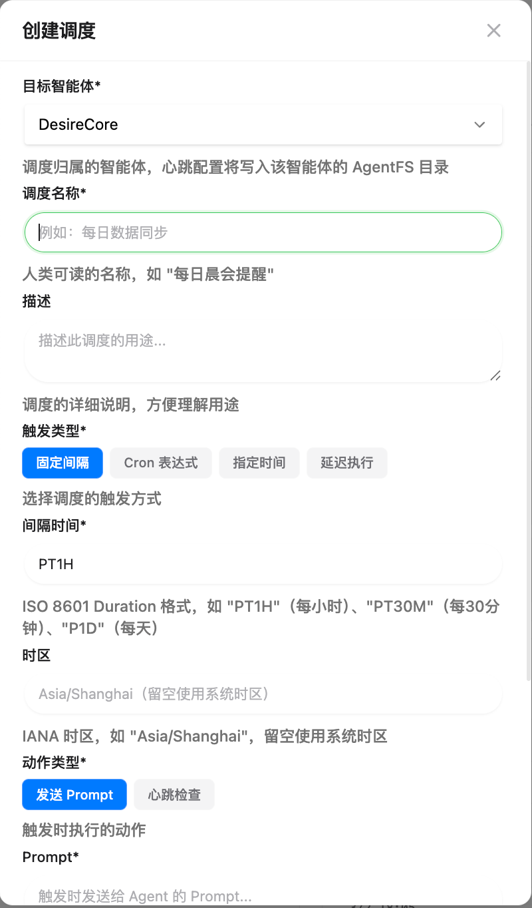
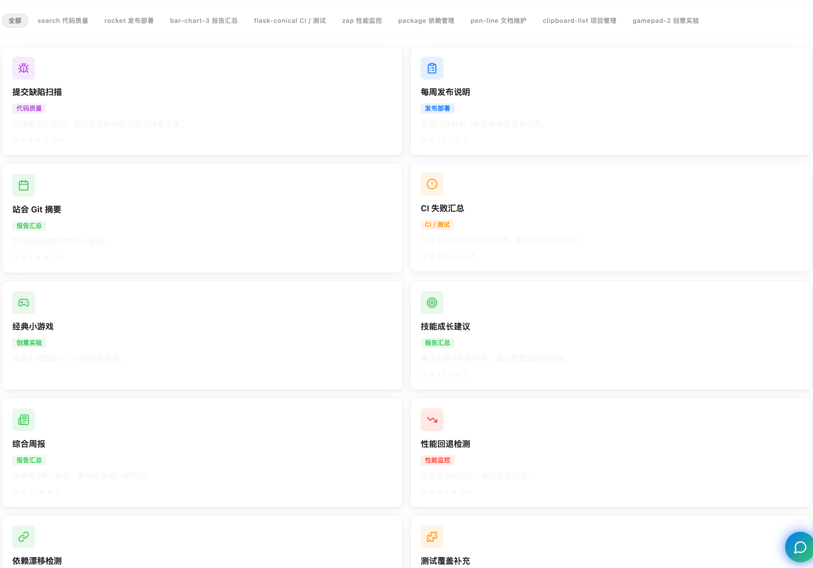

# 定时任务

重复性的工作不应该占用你的注意力。通过 DesireCore 的调度系统（Schedule System），你可以让智能体按照设定的时间自动执行任务。

## 用对话创建任务

在 DesireCore 中，创建定时任务最自然的方式是**直接和智能体对话**：

```
你："每天早上 8 点给我一份今日待办和日程概览"

智能体："好的，我来创建一个每日早报任务：
         ┌────────────────────────────────────────┐
         │  调度任务 · 创建                         │
         │  每日早报                               │
         │  每天 8:00 (Asia/Shanghai)              │
         │         [ 批准 ]    [ 拒绝 ]            │
         └────────────────────────────────────────┘"

你：[点击批准]

智能体："已创建。从明天开始，每天早上 8 点我会为你准备工作概览。"
```

你不需要填写复杂的表单或学习任何语法——用自然语言描述你的需求，智能体会帮你转换为调度规则。

智能体对时间相关的表达非常敏感，以下关键词都会触发调度创建：

- "提醒我"、"X 分钟后"、"每天"、"每周"、"每月"
- "闹钟"、"倒计时"、"定期"、"定时"
- 任何包含具体时间的请求

:::info 对话只能创建，不能修改
目前通过对话只能**创建**新的定时任务。如果需要修改已有任务的调度规则，请在自动化管理面板中操作。
:::

## 用表单创建任务

除了对话方式，你也可以在**自动化管理面板**中通过表单手动创建任务：

1. 打开自动化管理面板，点击右上角的 **创建** 按钮
2. 在弹出的创建对话框中填写：
   - **目标智能体** — 选择执行任务的智能体
   - **任务名称** — 为任务起一个描述性的名字（如"每日晨会提醒"）
   - **任务描述** — 补充说明（可选）
   - **触发类型** — 选择固定间隔、Cron 表达式、指定时间或延迟执行
   - **触发参数** — 根据类型填写对应的参数（如 Cron 表达式 `0 9 * * 1-5`）
   - **时区** — 选择 IANA 时区（如 `Asia/Shanghai`）
   - **动作类型** — 选择"发送 Prompt"或"心跳检查"
   - **Prompt 内容** — 如果动作类型为"发送 Prompt"，填写智能体要执行的指令
   - **标签** — 为任务添加分类标签（可选）
3. 确认后任务即刻生效



:::tip 两种方式各有所长
对话创建更快更自然，适合日常使用；表单创建提供了更精细的控制，适合需要精确设置 Cron 表达式或配置高级选项的场景。
:::

## 从模板快速创建

DesireCore 内置了一系列自动化模板，覆盖常见的研发和工作场景，帮助你快速创建调度任务。

在自动化管理面板中，点击 **模板** 按钮即可浏览所有可用模板。

### 模板分类

| 分类 | 说明 | 模板示例 |
|------|------|---------|
| **代码质量** | 自动化代码审查和缺陷检测 | 提交缺陷扫描 |
| **发布部署** | 发布流程自动化 | 每周发布说明、发版前检查 |
| **报告汇总** | 定期生成工作汇总 | 站会 Git 摘要、综合周报、PR 团队汇总、技能成长建议 |
| **CI / 测试** | 持续集成与测试监控 | CI 失败汇总、测试覆盖补充、CI 根因分组 |
| **性能监控** | 性能指标追踪 | 性能回退检测 |
| **依赖管理** | 依赖版本与安全维护 | 依赖漂移检测、依赖安全升级 |
| **文档维护** | 文档自动更新 | 文档自动更新 |
| **项目管理** | 任务与问题管理 | 问题分诊 |
| **创意实验** | 趣味性自动化 | 经典小游戏 |

选择模板后，系统会自动预填任务名称、描述和默认的 Cron 表达式。你只需要选择目标智能体、确认或调整参数即可完成创建。



## 四种调度类型

对话和表单创建支持四种时间规则：

| 类型 | 适用场景 | 自然语言示例 |
|------|---------|-------------|
| **指定时间（at）** | 在某个具体时刻触发一次 | "明天下午 3 点提醒我交报告" |
| **延迟执行（delay）** | 从现在开始倒计时 | "30 分钟后提醒我开会" |
| **固定间隔（interval）** | 每隔一段时间重复 | "每 30 分钟检查一次邮箱" |
| **日历周期（cron）** | 对齐日历的周期任务 | "工作日每天早上 9 点" |

### 时间格式说明

调度系统支持灵活的时间格式：

- **指定时间**：ISO 8601 日期时间格式（如 `2026-03-01T09:00:00+08:00`）
- **延迟执行**：ISO 8601 时长（如 `PT30M` 表示 30 分钟）或简写格式（如 `5m`、`1h30m`、`2d`）
- **固定间隔**：与延迟执行格式相同
- **日历周期**：标准 5 段 Cron 表达式（如 `0 9 * * 1-5`）

:::tip 选择建议
- 只触发一次？ → 用 **指定时间** 或 **延迟执行**
- 每隔固定时间？ → 用 **固定间隔**
- 每天/每周的固定时刻？ → 用 **日历周期**

不用纠结选哪种——直接用自然语言告诉智能体你的需求，它会自动选择合适的类型。
:::

## 两种动作类型

定时任务触发时，可以执行两种类型的动作：

| 动作类型 | 说明 | 适用场景 |
|----------|------|---------|
| **发送 Prompt（query）** | 向智能体发送一段指令，智能体执行后返回结果 | 生成报告、数据汇总、提醒等 |
| **心跳检查（heartbeat）** | 触发一次心跳巡检，检查数据源变化 | 定期监控邮箱、GitHub、日历等 |

"发送 Prompt"是最常用的动作类型——你可以在 Prompt 中写任何希望智能体执行的指令，它会像你手动发送消息一样被执行，结果通过通知推送给你。

:::info 心跳调度的唯一性
每个智能体只能有一个心跳类型的调度任务。创建新的心跳调度时，旧的会被自动替换。
:::

## 典型场景

### 每日早报

> "每天早上 8 点汇总今天的日程和待办"

智能体会在每天早上 8 点自动：
1. 检查你的日历事件
2. 整理待办事项
3. 查看重要邮件
4. 生成一份结构化的早报推送给你

### 定期检查

> "每 30 分钟检查 GitHub 和邮箱有没有新消息"

智能体会每隔 30 分钟：
1. 检查邮箱新邮件
2. 检查 GitHub 通知和 PR
3. 有变化时发送通知，没有变化时静默

### 延迟提醒

> "30 分钟后提醒我参加会议"

智能体会设一个 30 分钟的倒计时，到点后通过桌面通知和声音提醒你。这是一次性任务，触发后自动完成。

### 周报汇总

> "每周五下午 5 点提醒我写周报，并帮我汇总本周的工作"

每周五下午 5 点，智能体会：
1. 回顾本周的对话和任务
2. 整理关键成果和决策
3. 推送给你作为周报素材

## 自动化管理面板

所有定时任务统一在**自动化管理面板**中集中管理。


### 面板布局

面板采用左右分栏布局：

- **左侧**：调度任务列表，每个任务显示状态指示点、任务名称、所属智能体、调度规则描述和下次触发时间
- **右侧**：根据选择显示任务详情、模板浏览或引导页面

顶部还会显示当前运行中和已暂停的任务数量。

### 筛选与排序

面板顶部提供状态筛选标签页：

| 标签 | 说明 |
|------|------|
| **全部** | 显示所有调度任务 |
| **运行中** | 仅显示当前活跃的任务 |
| **已暂停** | 仅显示被暂停的任务 |
| **已完成** | 仅显示已完成或已取消的任务 |

任务列表默认按**下次触发时间**升序排列，即将触发的任务排在最前面。

### 任务状态

每个调度任务都有一个状态，反映它在生命周期中的位置：

| 状态 | 说明 |
|------|------|
| **待激活（pending）** | 已创建但尚未到达激活时间 |
| **运行中（active）** | 正常调度中，会按规则触发 |
| **已暂停（paused）** | 被手动暂停，不会触发 |
| **已完成（completed）** | 一次性任务已执行，或达到最大触发次数 |
| **已取消（cancelled）** | 被手动取消 |

## 管理定时任务

### 查看任务详情

在任务列表中点击某个任务，右侧面板会显示它的完整信息：

- **基本信息** — 智能体头像、任务名称、当前状态、启用/暂停开关、任务 ID
- **任务描述** — 补充说明文本（如有）
- **调度配置** — 触发类型、调度规则、时区、错过补偿策略等
- **触发目标** — 动作类型和 Prompt 内容
- **运行统计** — 下次触发时间、上次触发时间、总运行次数、错过次数
- **执行历史** — 最近的执行记录
- **标签** — 分类标签列表（如有）


### 暂停和恢复

不需要某个任务时，你可以暂停它而不删除：

- **暂停** — 停止调度，但保留配置和历史记录
- **恢复** — 继续按原规则调度

你可以在详情面板中通过开关快速切换任务的启用/暂停状态，也可以点击操作区域的暂停/恢复按钮。

### 手动触发

对于任何已创建的调度任务，你都可以随时点击 **立即触发** 按钮来手动执行一次，而无需等待下一个调度时间点。手动触发同样会被记录在执行历史中。

### 删除任务

不再需要的任务可以在详情面板中删除。为防止误操作，删除采用**两步确认**机制——第一次点击后按钮会变为确认状态，需要在 5 秒内再次点击才会真正删除。5 秒后自动恢复为普通状态。

## 生命周期控制

调度任务除了基本的触发规则外，还支持更精细的生命周期控制：

| 控制项 | 说明 |
|--------|------|
| **激活时间（starts_at）** | 任务在此时间之前不会触发，即使调度规则命中也会跳过 |
| **过期时间（expires_at）** | 任务在此时间之后自动停止，状态变为已完成 |
| **最大触发次数（max_fires）** | 达到设定的触发次数后自动完成 |

这些控制项让你可以创建"未来某天开始、某天结束"或"只执行 N 次"的调度任务，无需手动管理它们的生命周期。

## 时区支持

调度系统完全支持 IANA 时区标准。你可以为每个调度任务指定时区（如 `Asia/Shanghai`、`America/New_York`），所有的触发时间计算都会尊重该时区的设置。

如果未指定时区，系统会使用你的操作系统默认时区。

## 错过补偿

当 DesireCore 未运行时（比如电脑关机或应用退出），原本应该触发的调度任务会被"错过"。应用重新启动后，调度引擎会自动检测错过的触发，并根据**错过补偿策略**决定如何处理：

| 策略 | 说明 | 适用场景 |
|------|------|---------|
| **跳过（skip）** | 忽略错过的触发，直接等待下一次 | 心跳检查等实时性要求高的任务——过去的巡检结果已经没有意义 |
| **补偿一次（fire_once）** | 只执行一次补偿，使用最近一次错过的时间 | 每日报告等——不需要补回每一次，但需要确保不遗漏 |
| **全部补偿（fire_all）** | 按顺序补偿所有错过的触发 | 需要确保每次触发都被执行的关键任务 |

如果未显式设置，系统默认使用**跳过**策略。

:::info 补偿上限
"全部补偿"策略最多补偿 100 次错过的触发，以避免长时间离线后产生过多的补偿任务。多个智能体的补偿任务会并行处理（最多 3 个智能体同时执行），同一智能体的任务则按顺序串行执行。
:::

## 任务执行记录

每次调度触发都会生成执行记录，你可以在任务详情面板中查看完整的执行历史：

| 字段 | 说明 |
|------|------|
| **触发时间** | 实际触发的时间点 |
| **状态** | 成功（绿色）/ 失败（红色）/ 已跳过（灰色） |
| **耗时** | 本次执行的持续时间 |
| **备注** | 失败原因或补偿触发标记 |

执行历史支持分页浏览，每页显示 5 条记录。


:::info 执行失败怎么办
如果调度任务执行失败（比如数据源暂时不可用），系统会记录失败原因。对于周期性任务，下一次调度仍会正常触发。你可以在执行记录中查看失败详情。
:::

## 调度与通知

定时任务的执行结果通过通知系统推送给你：

1. 调度引擎在预定时间触发任务
2. 智能体执行任务内容
3. 执行完成后，结果通过通知推送
4. 通知记录保存在通知中心

:::tip 实时同步
调度任务的状态变化（如触发、暂停、完成）会通过实时通道即时同步到界面，无需手动刷新。
:::
