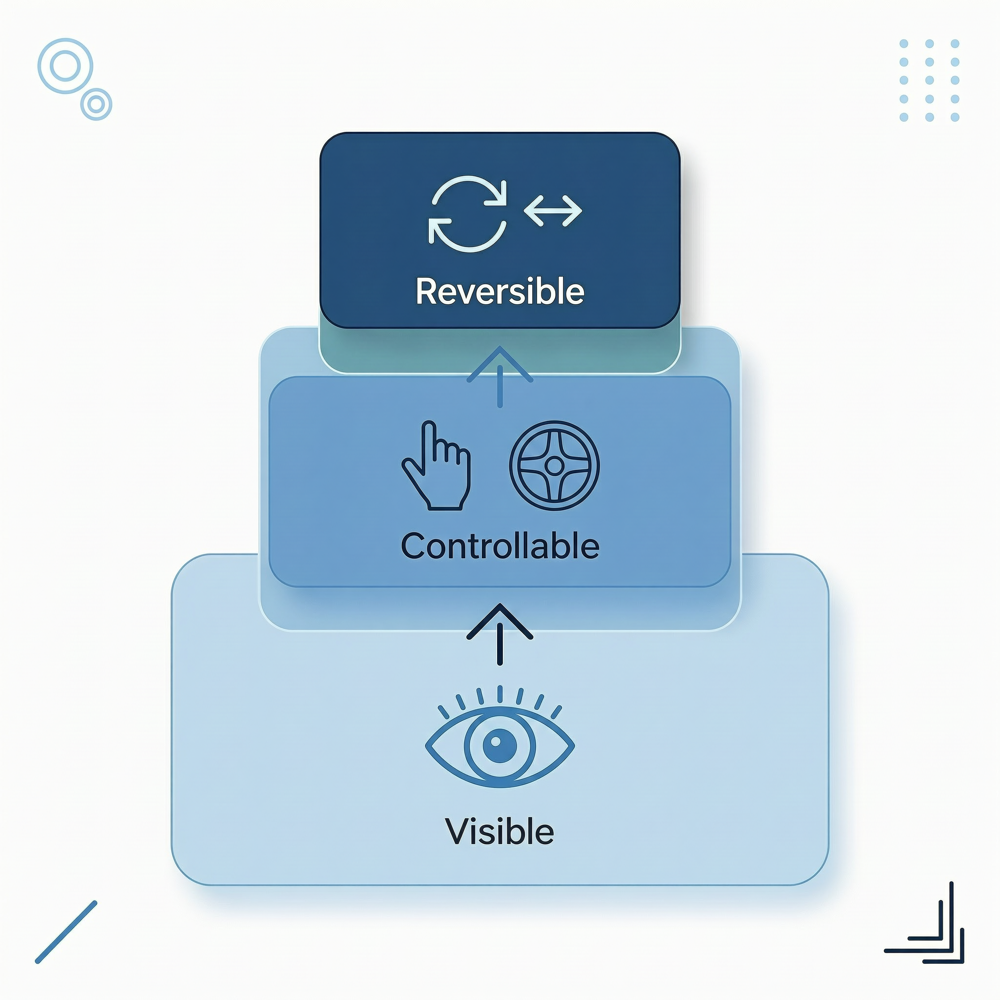

# 三层可控性

DesireCore 提供执行记录、审批规则和检查点恢复，分别对应可见、可控、可逆。下面说明各项能力的入口和边界。



## 第一层：可见（Visible）

> 你能看到智能体在做什么。

你可以在工具卡片、执行回执和活动记录中查看操作与结果。

**具体体现：**

- **操作前确认**：需要审批的操作会显示确认卡片，展示操作类型、参数和风险；是否需要审批由当前模式和权限规则决定
- **来源追溯**：每个操作请求都会说明"为什么要执行这个操作"，追溯到你的哪条指令触发了它
- **详情展开**：你可以展开查看完整的操作参数，例如要修改的文件内容 diff、要执行的命令全文
- **执行回执**：每次任务完成后生成详细回执，记录工具调用链、决策依据和产出物

:::tip
可见性不等于信息轰炸。DesireCore 会根据风险等级决定展示信息的详略程度——低风险操作简要提示，高风险操作详细展示。
:::

## 第二层：可控（Controllable）

> 你能随时干预和修改。

看到了不够，你还需要能够影响智能体的行为。

**具体体现：**

- **三选一决策**：面对智能体的操作请求，你可以选择"允许"、"拒绝"或"修改"
  - **允许**：让智能体执行操作
  - **拒绝**：取消操作，智能体需要调整方案
  - **修改**：打开编辑面板，手动调整操作参数后再执行
- **规则记忆**：对于支持记住规则的操作，选择“允许并记住”；后续命中该规则的操作按规则放行
- **权限规则管理**：在设置中集中查看和管理所有已记住的权限规则，支持编辑、禁用和删除
- **中断能力**：任务执行过程中，你随时可以点击停止按钮中断

## 第三层：可逆（Reversible）

> 通过检查点查看和恢复本地变更。

打开 [Rewind 与 Checkpoint](../02-conversations/10-rewind-checkpoints.md)，先查看差异和恢复范围，再决定是否恢复。

| 内容 | 恢复边界 |
|---|---|
| 对话记录与本地文件 | 以实际检查点覆盖的记录和可恢复文件为准 |
| 已发邮件、付款、发布等外部操作 | 需要通过对应服务处理，本地回退不能撤销 |
| 中断的任务 | 先核对成果、执行记录和仍在运行的命令，再继续或重试 |

恢复对话不会自动重启全部步骤。继续涉及外部操作的任务前，先确认该操作是否已经执行，避免重复。

## 三层协同

执行过程中，可以按下面的顺序检查：

```
可见 → 你知道发生了什么
  ↓
可控 → 你决定是否继续
  ↓
可逆 → 核对检查点范围，再恢复本地变更
```

需要更改审批方式时，先查看当前模式允许哪些操作，再调整设置。

## 与审批模式的关系

三层可控性通过[工具与命令审批模式](./05-ai-approval.md)落地执行：

- **可见**：审批卡片展示操作类型、参数、来源追溯和风险等级
- **可控**：你可以选择允许、拒绝或修改操作参数
- **可逆**：通过检查点恢复受支持的本地变更；外部副作用需另行处理

不同的审批模式决定了"可控"层的介入时机——从每次都询问到全部放行，你可以根据对智能体的信任程度灵活调整。

## 相关页面

- [风险等级](./02-risk-levels.md)：了解操作如何被分级
- [工具与命令审批模式](./05-ai-approval.md)：五种审批模式详解
- [审计跟踪](./03-audit-trail.md)：查看操作历史记录
- [数据安全](./04-data-security.md)：了解数据如何被保护

:::info
DesireCore 的安全设计借鉴了 NIST AI 安全框架的人机协作原则，同时根据桌面应用的特点做了本地化适配。我们相信，好的安全机制应该让你感到安心，而不是感到束缚。
:::
