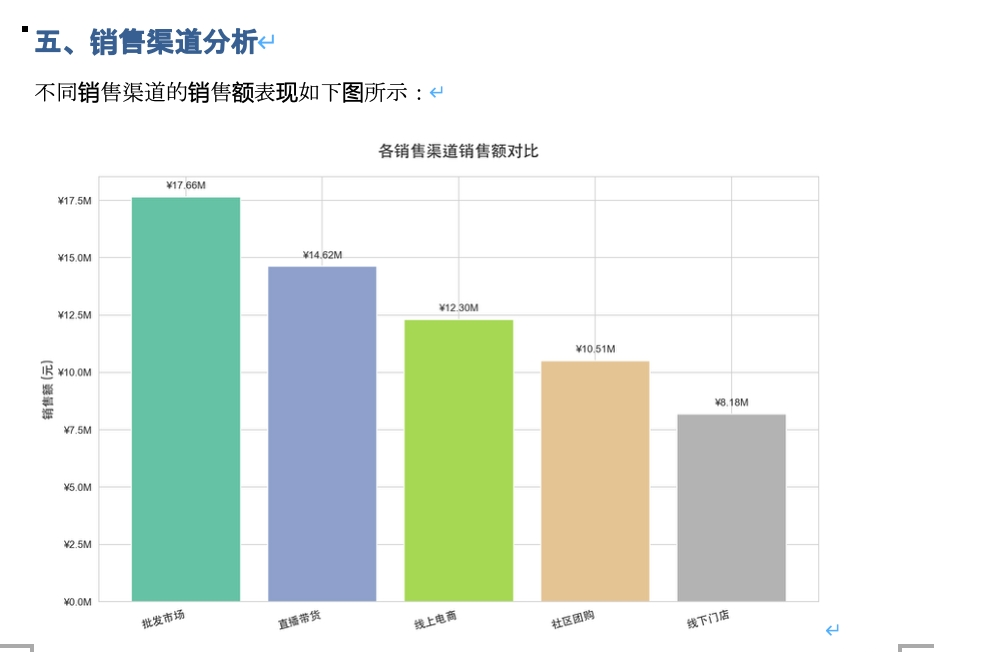

# 智能体生成标准数据分析报告

## 真实工作流

这个场景适合周期性报告。它的真实痛点不是“不会分析”，而是每次都要重复取数、套模板、做图、写同一种结构的小结。

| 维度 | 真实情况 |
|------|----------|
| 触发点 | 销售周报、运营月报、财务季报、部门经营分析等固定周期报告 |
| 现有材料 | 本期数据、上期报告、公司模板、指标口径、图表样式要求 |
| 卡点 | 多部门数据格式不一致，报告模板固定但填充繁琐，异常解释容易漏 |
| DesireCore 介入 | 数据分析报告智能体按模板生成各部门报告和汇总版，并标出异常指标 |
| 验收结果 | 分析师重点检查异常解释和管理建议，不再把时间花在复制粘贴和排版上 |

## 使用前后对比

| 环节 | 使用前（人工） | 使用后（DesireCore） |
|------|---------------|---------------------|
| 数据汇总 | 从多个系统导出再手动合并，格式不一致 | 提供数据源后自动清洗合并，统一口径 |
| 套模板 | 打开上期报告复制粘贴改数字，1-2 小时 | 按预设模板自动填充本期数据和图表 |
| 异常标注 | 逐行对比才发现某指标异常 | 自动标出偏离阈值的指标并给出初步归因 |
| 多版本输出 | 各部门要不同维度，手动裁剪多份 | 一次生成各部门版本和汇总版 |
| 报告周期 | 周报每次花半天，月报花一天 | 数据就位后 15 分钟产出完整报告初稿 |

---

## 可以处理哪些工作

### 多源数据接入

- **Excel / CSV**：自动识别表头、数据类型，处理合并单元格
- **数据库查询**：支持 MySQL、PostgreSQL、SQLite，自然语言转 SQL
- **API 数据源**：对接业务系统，实时拉取最新数据

### 报告模板管理

- **预置模板库**：销售报告、运营报告、财务报告等常用模板
- **自定义模板**：支持上传企业标准模板，定义章节结构
- **样式继承**：字体、配色、图表风格与企业 VI 保持一致

### 分析与可视化

- **自动统计分析**：汇总、环比、同比、占比等常用指标自动计算
- **图表生成**：根据数据特征选择柱状图、折线图、饼图等
- **异常标注**：自动识别数据异常点并在报告中高亮提示
- **趋势解读**：基于数据变化自动生成文字分析结论

### 标准格式输出

- **Word 文档**：符合企业模板的 .docx 格式，可直接编辑
- **PDF 报告**：排版精美，适合分发和存档
- **PPT 演示**：自动生成汇报用幻灯片
- **在线预览**：生成前可预览，支持微调后再导出

---

## 工作流控制点

| 阶段 | 需要确认的细节 |
|------|----------------|
| 数据接入 | 每个部门的数据范围、时间口径、字段名和单位是否一致 |
| 数据清洗 | 是否存在空值、重复行、异常值、合并单元格和分类名称不一致 |
| 指标计算 | 环比、同比、占比、客单价等指标是否使用公司统一口径 |
| 图表生成 | 图表是否服务结论，而不是为了“好看”堆图 |
| 文字结论 | 每条结论是否能追溯到具体数据、图表或业务解释 |
| 模板输出 | 标题、目录、页眉页脚、图表样式和导出格式是否符合公司标准 |

---

## 会用到的 DesireCore 能力

- **Workflow / SOP**：把月报、周报、季报流程固化为固定步骤，减少每次重新说明
- **多 Agent 协作**：数据分析师负责计算和图表，AI 文书负责报告文字和排版
- **定时任务**：可在固定时间自动生成周期报告或提醒你补充数据源

---

## 典型使用场景

### 场景一：消费行业销售数据分析报告



文件地址： ./assets/data-analysis/case1/消费行业销售数据分析报告.docx
```
📁 输入
    ├── 销售数据.xlsx（350 条记录，覆盖 7 大地区、140 个城市）
    └── 用户指令："生成消费行业销售数据分析报告"

⬇️ 智能体处理后

📄 输出：消费行业销售数据分析报告.docx
    ├── 📌 一、执行摘要
    │   └── 年度总销售额 ¥63.27 百万元，总销量 285,807 件
    ├── 📊 二、关键指标概览（表格）
    │   ├── 总销售额：¥63,274,132.42
    │   ├── 总销量：285,807 件
    │   ├── 平均客单价：¥241.13
    │   └── 覆盖城市数：140 个
    ├── 🗺️ 三、地区销售分析
    │   ├── 各地区销售额占比饼图
    │   └── 结论：华东地区占比 20.5%，表现最突出
    ├── 🏷️ 四、产品品类分析
    │   ├── 各品类销售额对比柱状图
    │   └── 结论：数码家电最高达 ¥28.27 百万元
    ├── 🏪 五、销售渠道分析
    │   ├── 各渠道销售额对比图
    │   └── 结论：批发市场渠道 ¥17.66 百万元领先
    ├── 📈 六、月度销售趋势
    │   ├── 月度销售额折线图
    │   └── 结论：10 月峰值，8 月低谷，呈季节性波动
    ├── 🏙️ 七、城市销售排名
    │   ├── TOP10 城市柱状图
    │   └── 结论：长治 ¥2.79 百万元居首
    ├── 🔍 八、销量与销售额关系分析
    │   ├── 品类散点图（销量 vs 销售额）
    │   └── 结论：数码家电高单价、食品饮料靠高销量
    └── 💡 九、结论与建议
        ├── 主要发现（5 条）
        └── 策略建议（5 条）
```

### 场景二：运营月报批量生成

```
📁 输入
    ├── 各业务线运营数据（5 个部门）
    ├── 运营月报标准模板
    └── 用户指令："为每个部门生成独立的月报"

⬇️ 智能体处理后

📄 输出
    ├── 产品部_运营月报_202404.pdf
    ├── 市场部_运营月报_202404.pdf
    ├── 客服部_运营月报_202404.pdf
    ├── 技术部_运营月报_202404.pdf
    ├── 销售部_运营月报_202404.pdf
    └── 全公司_运营汇总_202404.pdf
```

### 场景三：财务季度报告

文件地址：./assets/data-analysis/finance_q1_report
```
📁 输入
    ├── Q1 财务数据（收入、成本、利润明细）
    ├── 财务报告模板（含审计要求格式）
    └── 用户指令："生成 Q1 财务分析报告"

⬇️ 智能体处理后

📄 输出：2024Q1_财务分析报告.pdf
    ├── 财务摘要（关键指标一览表）
    ├── 收入分析（按产品线、按区域）
    ├── 成本结构（同比变化分析）
    ├── 利润分析（毛利率、净利率趋势）
    ├── 现金流概况
    └── 风险提示与建议
```

---

## 效率对比

| 指标 | 手动制作报告 | 固定脚本生成 | 数据分析报告智能体 |
|------|--------------|--------------|-----------|
| 单份报告耗时 | 通常需要数小时 | 开发完成后较快 | 适合先生成可审阅初稿 |
| 批量生成（10 份） | 容易被排版和复制粘贴占满时间 | 适合固定格式 | 适合模板一致、数据源不同的批量任务 |
| 模板适配成本 | 每次手动调整 | 需修改代码 | 自然语言描述 |
| 异常分析能力 | 依赖人工经验 | 需预设规则 | 辅助识别 |
| 结论撰写 | 人工撰写 | 无 | 生成初稿 |
| 格式一致性 | 易出错 | 高 | 高 |

:::tip 使用建议
何洁这类周期性报告最适合先固化模板和指标口径。模板稳定后，每月主要检查异常解释和管理建议，不需要反复调整版式。
:::
