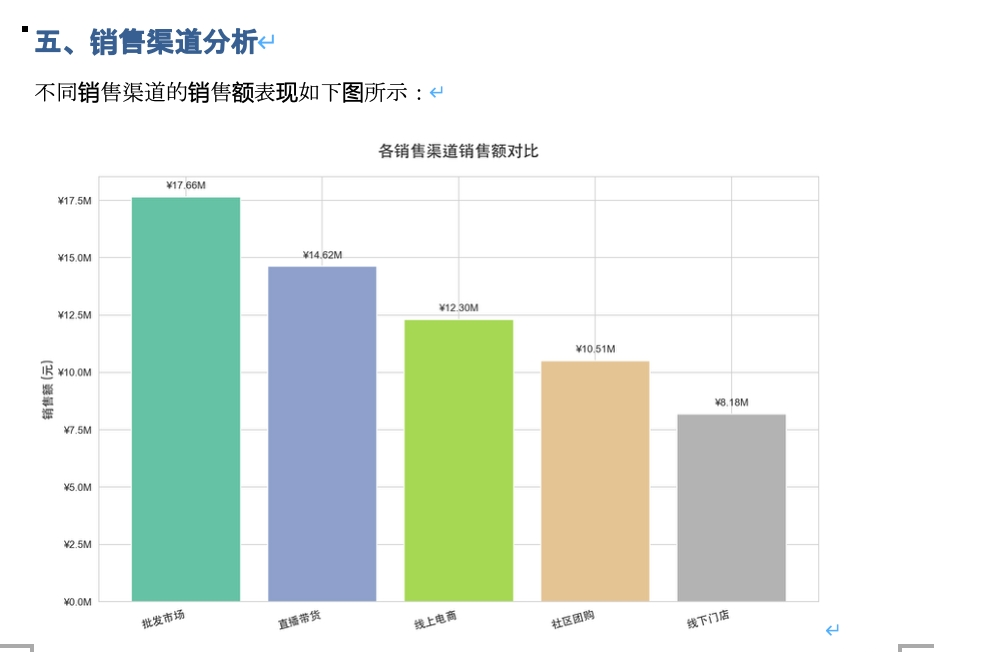

# 智能体生成标准数据分析报告

> **与[数据分析](./02-data-analysis.md)的区别**：`02-data-analysis.md` 侧重数据清洗和趋势分析（输入数据 → 输出洞察），本文档侧重**报告生成**（输入数据+模板 → 输出格式规范的文档）。两者互补使用。

## 痛点
每周、每月、每季度——业务部门都需要提交各种数据分析报告：销售周报、运营月报、财务季报。报告格式有严格要求，图表样式要统一，数据口径要一致。分析师花大量时间在"套模板"上：从 Excel 导数据、调格式、做图表、写结论，一份报告动辄半天。
这个用例让 AI 智能体自动生成符合企业标准的数据分析报告，输入原始数据和报告模板，输出格式规范、图文并茂的专业报告。

---

## 它能做什么

### 📥 多源数据接入

- **Excel / CSV**：自动识别表头、数据类型，处理合并单元格
- **数据库查询**：支持 MySQL、PostgreSQL、SQLite，自然语言转 SQL
- **API 数据源**：对接业务系统，实时拉取最新数据

### 📋 报告模板管理

- **预置模板库**：销售报告、运营报告、财务报告等常用模板
- **自定义模板**：支持上传企业标准模板，定义章节结构
- **样式继承**：字体、配色、图表风格与企业 VI 保持一致

### 📊 智能分析与可视化

- **自动统计分析**：汇总、环比、同比、占比等常用指标自动计算
- **智能图表生成**：根据数据特征自动选择柱状图、折线图、饼图等
- **异常标注**：自动识别数据异常点并在报告中高亮提示
- **趋势解读**：基于数据变化自动生成文字分析结论

### 📄 标准格式输出

- **Word 文档**：符合企业模板的 .docx 格式，可直接编辑
- **PDF 报告**：排版精美，适合分发和存档
- **PPT 演示**：自动生成汇报用幻灯片
- **在线预览**：生成前可预览，支持微调后再导出

---

## 典型使用场景

### 场景一：消费行业销售数据分析报告



文件地址： ./assets/data-analysis/case1/消费行业销售数据分析报告.docx
```
📁 输入
    ├── 销售数据.xlsx（350 条记录，覆盖 7 大地区、140 个城市）
    └── 用户指令："生成消费行业销售数据分析报告"

⬇️ 智能体处理（约 3-5 分钟）

📄 输出：消费行业销售数据分析报告.docx
    ├── 📌 一、执行摘要
    │   └── 年度总销售额 ¥63.27 百万元，总销量 285,807 件
    ├── 📊 二、关键指标概览（表格）
    │   ├── 总销售额：¥63,274,132.42
    │   ├── 总销量：285,807 件
    │   ├── 平均客单价：¥241.13
    │   └── 覆盖城市数：140 个
    ├── 🗺️ 三、地区销售分析
    │   ├── 各地区销售额占比饼图
    │   └── 结论：华东地区占比 20.5%，表现最突出
    ├── 🏷️ 四、产品品类分析
    │   ├── 各品类销售额对比柱状图
    │   └── 结论：数码家电最高达 ¥28.27 百万元
    ├── 🏪 五、销售渠道分析
    │   ├── 各渠道销售额对比图
    │   └── 结论：批发市场渠道 ¥17.66 百万元领先
    ├── 📈 六、月度销售趋势
    │   ├── 月度销售额折线图
    │   └── 结论：10 月峰值，8 月低谷，呈季节性波动
    ├── 🏙️ 七、城市销售排名
    │   ├── TOP10 城市柱状图
    │   └── 结论：长治 ¥2.79 百万元居首
    ├── 🔍 八、销量与销售额关系分析
    │   ├── 品类散点图（销量 vs 销售额）
    │   └── 结论：数码家电高单价、食品饮料靠高销量
    └── 💡 九、结论与建议
        ├── 主要发现（5 条）
        └── 策略建议（5 条）
```

### 场景二：运营月报批量生成

```
📁 输入
    ├── 各业务线运营数据（5 个部门）
    ├── 运营月报标准模板
    └── 用户指令："为每个部门生成独立的月报"

⬇️ 智能体处理（约 8-10 分钟）

📄 输出
    ├── 产品部_运营月报_202404.pdf
    ├── 市场部_运营月报_202404.pdf
    ├── 客服部_运营月报_202404.pdf
    ├── 技术部_运营月报_202404.pdf
    ├── 销售部_运营月报_202404.pdf
    └── 全公司_运营汇总_202404.pdf
```

### 场景三：财务季度报告

文件地址：./assets/data-analysis/finance_q1_report
```
📁 输入
    ├── Q1 财务数据（收入、成本、利润明细）
    ├── 财务报告模板（含审计要求格式）
    └── 用户指令："生成 Q1 财务分析报告"

⬇️ 智能体处理（约 5-8 分钟）

📄 输出：2024Q1_财务分析报告.pdf
    ├── 财务摘要（关键指标一览表）
    ├── 收入分析（按产品线、按区域）
    ├── 成本结构（同比变化分析）
    ├── 利润分析（毛利率、净利率趋势）
    ├── 现金流概况
    └── 风险提示与建议
```

---

## 效率对比

| 指标 | 手动制作报告 | 固定脚本生成 | AI 智能体 |
|------|--------------|--------------|-----------|
| 单份报告耗时 | ~3 小时 | ~10 分钟 | ~3 分钟 |
| 批量生成（10 份） | ~30 小时 | ~20 分钟 | ~15 分钟 |
| 模板适配成本 | 每次手动调整 | 需修改代码 | 自然语言描述 |
| 异常分析能力 | 依赖人工经验 | 需预设规则 | 智能识别 |
| 结论撰写 | 人工撰写 | 无 | 自动生成 |
| 格式一致性 | 易出错 | 高 | 高 |
