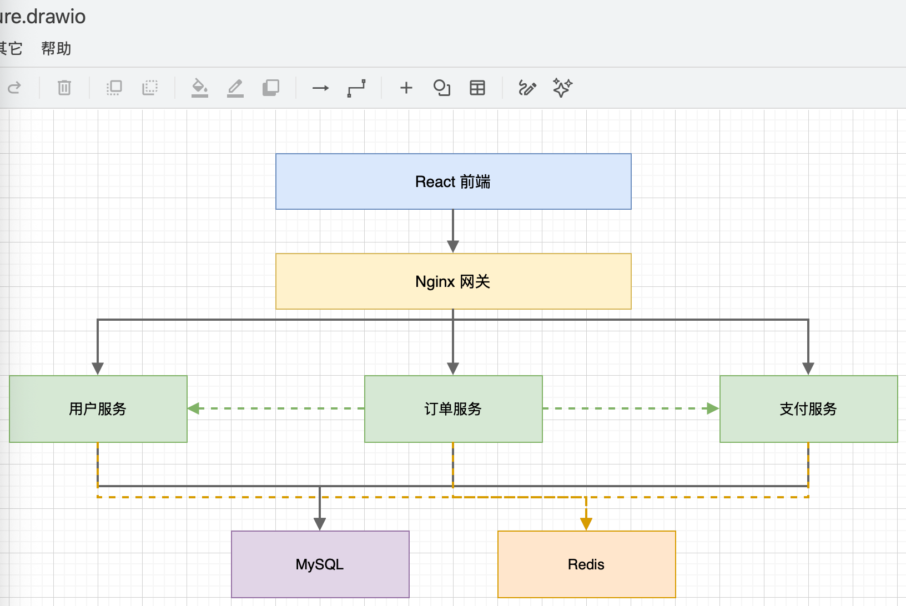

# 智能体自动生成流程图

## 痛点

产品经理写 PRD 要画流程图，开发写技术文档要画架构图，运营写 SOP 要画业务流程——每次都要打开 Visio、ProcessOn 或 draw.io，一个个拖拽节点、连线、对齐、调样式。一张稍复杂的流程图，画完加美化，半小时起步。

这个用例让 AI 智能体根据自然语言描述或文档内容，自动生成专业的流程图，支持多种格式导出，省去繁琐的手动绑定。

---

## 它能做什么

### 📝 自然语言输入

- **口语化描述**："用户下单后，先检查库存，有货就生成订单，没货就提示缺货"
- **文档解析**：上传 PRD / SOP 文档，自动提取流程逻辑
- **代码分析**：读取代码文件，生成函数调用流程图

### 🎨 智能图表生成

- **流程图**：标准 Flowchart，支持判断、循环、并行分支
- **时序图**：系统交互、API 调用时序
- **架构图**：系统架构、部署拓扑
- **泳道图**：跨部门/角色的业务流程
- **思维导图**：层级结构、知识梳理

### 🔧 灵活调整

- **自然语言修改**："把审批节点改成两级审批"
- **样式定制**：配色方案、节点形状、连线样式
- **布局优化**：自动对齐、间距调整、方向切换

### 📤 多格式导出

- **图片格式**：PNG、SVG、PDF
- **可编辑格式**：Mermaid 代码、draw.io XML、Visio
- **在线分享**：生成分享链接，支持协作编辑

---

## 典型使用场景

### 场景一：产品需求流程图

```
📁 输入
    └── 用户描述："画一个电商退货流程：用户申请退货，
        客服审核，通过后用户寄回商品，仓库验收，
        验收通过退款，不通过则拒绝退货"

⬇️ 智能体处理（约 10 秒）

📊 输出：退货流程图.png
    ┌─────────┐
    │ 用户申请 │
    │  退货   │
    └────┬────┘
         ↓
    ┌─────────┐
    │ 客服审核 │
    └────┬────┘
         ↓
    ◇ 审核结果 ◇───否──→ 【拒绝退货】
         │是
         ↓
    ┌─────────┐
    │ 用户寄回 │
    │  商品   │
    └────┬────┘
         ↓
    ┌─────────┐
    │ 仓库验收 │
    └────┬────┘
         ↓
    ◇ 验收结果 ◇───否──→ 【拒绝退货】
         │是
         ↓
    ┌─────────┐
    │ 退款完成 │
    └─────────┘
```

### 场景二：技术架构图

```
📁 输入
    └── 用户描述："画一个微服务架构图，包含：
        前端 React，网关 Nginx，
        用户服务、订单服务、支付服务，
        数据库用 MySQL 和 Redis"

⬇️ 智能体处理（约 15 秒）

📊 输出：微服务架构图.draw.io


```

文件地址：./assets/flowchart/microservice-architecture.drawio

### 场景三：从文档提取流程

```
📁 输入
    ├── 员工入职SOP.docx（3页文字描述）
    └── 用户指令："提取入职流程，生成泳道图"

⬇️ 智能体处理（约 30 秒）

📊 输出：入职流程泳道图.png

    HR          │  IT部门      │  用工部门     │  新员工
    ────────────┼──────────────┼──────────────┼──────────
    发送offer   │              │              │
        ↓       │              │              │
    准备合同    │              │              │ 确认入职
        ↓       │              │              │     ↓
    入职登记 ───┼→ 开通账号 ───┼→ 安排工位 ───┼→ 报到
        ↓       │      ↓       │      ↓       │     ↓
    社保办理    │  配发设备    │  介绍团队    │  入职培训
        ↓       │              │              │     ↓
    归档        │              │              │  试用期开始
```

---

## 效率对比

| 指标 | 手动绑定（Visio/draw.io） | AI 智能体 |
|------|---------------------------|-----------|
| 简单流程图（5-10 节点） | ~15 分钟 | ~10 秒 |
| 复杂流程图（20+ 节点） | ~45 分钟 | ~30 秒 |
| 修改调整 | 手动拖拽 | 自然语言描述 |
| 样式统一 | 需手动设置 | 自动应用模板 |
| 格式转换 | 逐个导出 | 一键多格式 |
| 学习成本 | 需熟悉工具 | 零门槛 |
