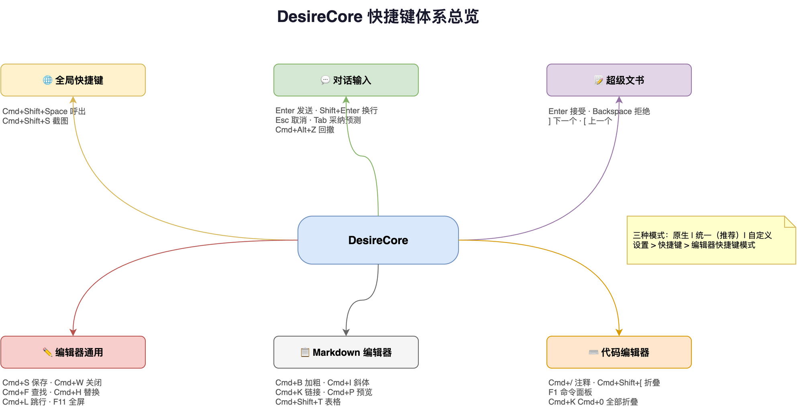

# 快捷键速查表

DesireCore 提供三种快捷键模式，你可以在「设置 > 快捷键 > 编辑器快捷键模式」中切换。

## 快捷键模式

| 模式 | 说明 | 适合人群 |
|------|------|---------|
| **原生模式** | 保留各编辑器的内置快捷键 | 不想改变习惯的用户 |
| **统一模式**（推荐） | 使用 DesireCore 统一快捷键 | 大多数用户 |
| **自定义模式** | 完全接管，允许自定义所有快捷键 | 高级用户 |

以下列出统一模式下的默认快捷键。`Mod` 表示 macOS 的 `Cmd`，以及 Windows/Linux 的 `Ctrl`。部分快捷键始终使用 `Ctrl`，不会随平台切换。

## 全局快捷键

| 操作 | macOS | Windows/Linux | 说明 |
|------|-------|--------------|------|
| 显示/隐藏窗口 | `Ctrl+Alt+Space` | `Ctrl+Alt+Space` | 快速呼出应用 |
| 截图 | `Cmd+Shift+S` | `Ctrl+Shift+S` | 截取屏幕内容 |

## 工作区标签

工作区快捷键在窗口级生效，用于切换对话中的文件、终端、网页和审阅等资源标签。`Ctrl+Tab` 系列在所有平台保持不变。

| 操作 | macOS | Windows/Linux | 说明 |
|------|-------|--------------|------|
| 新建工作区标签 | `Cmd+T` | `Ctrl+T` | 新建复合页 |
| 关闭当前标签 | `Cmd+W` | `Ctrl+W` | 按资源类型的关闭规则处理，必要时先确认 |
| 下一个标签 | `Ctrl+Tab` | `Ctrl+Tab` | 按工作区顺序切换 |
| 上一个标签 | `Ctrl+Shift+Tab` | `Ctrl+Shift+Tab` | 按工作区顺序切换 |
| 下一个标签（备用） | `Cmd+Alt+→` | `Ctrl+PageDown` | 可使用备用组合 |
| 上一个标签（备用） | `Cmd+Alt+←` | `Ctrl+PageUp` | 可使用备用组合 |
| 跳到第 1–8 个标签 | `Cmd+1`–`Cmd+8` | `Ctrl+1`–`Ctrl+8` | 按混合资源标签顺序选择 |
| 跳到最后一个标签 | `Cmd+9` | `Ctrl+9` | 选择最后一个资源标签 |
| 聚焦网址栏 | `Cmd+L` | `Ctrl+L` | 网页标签中可用 |
| 显示/隐藏工作区 | `Cmd+Shift+B` | `Ctrl+Shift+B` | 展开或收起资源工作区 |

如果标签快捷键没有响应，先关闭遮挡工作区的对话框或浮层；若使用自定义组合键，再到「设置 > 快捷键」检查并消除冲突。

## 对话输入

| 操作 | macOS | Windows/Linux | 说明 |
|------|-------|--------------|------|
| 发送消息 | `Enter` | `Enter` | 在输入框中发送消息 |
| 换行 | `Shift+Enter` | `Shift+Enter` | 在输入框中插入换行 |
| 取消输入 | `Escape` | `Escape` | 取消当前输入 |
| 采纳预测 | `Tab` 或 `→` | `Tab` 或 `→` | 接受下一条消息预测 |
| Rewind | `Cmd+Alt+Z` | `Ctrl+Alt+Z` | 回撤到检查点 |

## 超级文书

超级文书通过审阅面板按钮接受或拒绝修改。`Tab` 聚焦按钮后可按 `Enter` 或空格激活；在审阅浮层内按 `Esc` 收起面板。

## 通用编辑

| 操作 | macOS | Windows/Linux | 说明 |
|------|-------|--------------|------|
| 撤销 | `Cmd+Z` | `Ctrl+Z` | 撤销上一步操作 |
| 重做 | `Cmd+Shift+Z` | `Ctrl+Y` | 重做上一步操作 |
| 剪切 | `Cmd+X` | `Ctrl+X` | 剪切选中内容 |
| 复制 | `Cmd+C` | `Ctrl+C` | 复制选中内容 |
| 粘贴 | `Cmd+V` | `Ctrl+V` | 粘贴剪贴板内容 |
| 全选 | `Cmd+A` | `Ctrl+A` | 选中所有内容 |

## 编辑器通用

| 操作 | macOS | Windows/Linux | 说明 |
|------|-------|--------------|------|
| 保存 | `Cmd+S` | `Ctrl+S` | 保存当前文件 |
| 另存为 | `Cmd+Shift+S` | `Ctrl+Shift+S` | 另存为新文件 |
| 关闭文件 | `Cmd+W` | `Ctrl+W` | 关闭当前文件 |
| 查找 | `Cmd+F` | `Ctrl+F` | 在文件中查找 |
| 替换 | `Cmd+H` | `Ctrl+H` | 查找并替换 |
| 查找下一个 | `Cmd+G` | `F3` | 查找下一个匹配项 |
| 查找上一个 | `Cmd+Shift+G` | `Shift+F3` | 查找上一个匹配项 |
| 跳转到行 | `Cmd+L` | `Ctrl+G` | 跳转到指定行号 |
| 全屏 | `Cmd+Shift+F` | `F11` | 切换全屏模式 |

## Markdown 编辑器

| 操作 | macOS | Windows/Linux | 说明 |
|------|-------|--------------|------|
| 加粗 | `Cmd+B` | `Ctrl+B` | 加粗选中文字 |
| 斜体 | `Cmd+I` | `Ctrl+I` | 斜体选中文字 |
| 行内代码 | `` Cmd+` `` | `` Ctrl+` `` | 标记为行内代码 |
| 删除线 | `Cmd+Shift+X` | `Ctrl+Shift+X` | 添加删除线 |
| 插入链接 | `Cmd+K` | `Ctrl+K` | 插入链接 |
| 插入图片 | `Cmd+Shift+I` | `Ctrl+Shift+I` | 插入图片 |
| 插入表格 | `Cmd+Shift+T` | `Ctrl+Shift+T` | 插入表格 |
| 插入代码块 | `Cmd+Shift+K` | `Ctrl+Shift+K` | 插入代码块 |
| 切换预览 | `Cmd+P` | `Ctrl+P` | 切换编辑/预览模式 |

## 富文本编辑器

| 操作 | macOS | Windows/Linux | 说明 |
|------|-------|--------------|------|
| 加粗 | `Cmd+B` | `Ctrl+B` | 加粗选中文字 |
| 斜体 | `Cmd+I` | `Ctrl+I` | 斜体选中文字 |
| 下划线 | `Cmd+U` | `Ctrl+U` | 下划线选中文字 |
| 删除线 | `Cmd+Shift+X` | `Ctrl+Shift+X` | 添加删除线 |
| 插入链接 | `Cmd+K` | `Ctrl+K` | 插入超链接 |
| 标题 1 | `Cmd+1` | `Ctrl+1` | 设为一级标题 |
| 标题 2 | `Cmd+2` | `Ctrl+2` | 设为二级标题 |
| 标题 3 | `Cmd+3` | `Ctrl+3` | 设为三级标题 |

## YAML/代码编辑器

| 操作 | macOS | Windows/Linux | 说明 |
|------|-------|--------------|------|
| 格式化文档 | `Cmd+Shift+F` | `Ctrl+Shift+F` | 自动格式化代码 |
| 切换注释 | `Cmd+/` | `Ctrl+/` | 切换行注释 |
| 折叠代码 | `Cmd+Shift+[` | `Ctrl+Shift+[` | 折叠当前区域 |
| 展开代码 | `Cmd+Shift+]` | `Ctrl+Shift+]` | 展开当前区域 |
| 折叠全部 | `Cmd+K Cmd+0` | `Ctrl+K Ctrl+0` | 折叠所有代码区域 |
| 展开全部 | `Cmd+K Cmd+J` | `Ctrl+K Ctrl+J` | 展开所有代码区域 |
| 命令面板 | `F1` | `F1` | 打开 Monaco 命令面板 |

## 自定义快捷键

在「设置 > 快捷键」中，你可以：

- 悬停在任意快捷键上，点击"编辑"进入修改模式
- 按下新的组合键完成设置
- 系统会自动检测冲突并提醒
- 点击"重置"可恢复默认快捷键
- 点击"重置所有"可一键恢复全部默认设置
