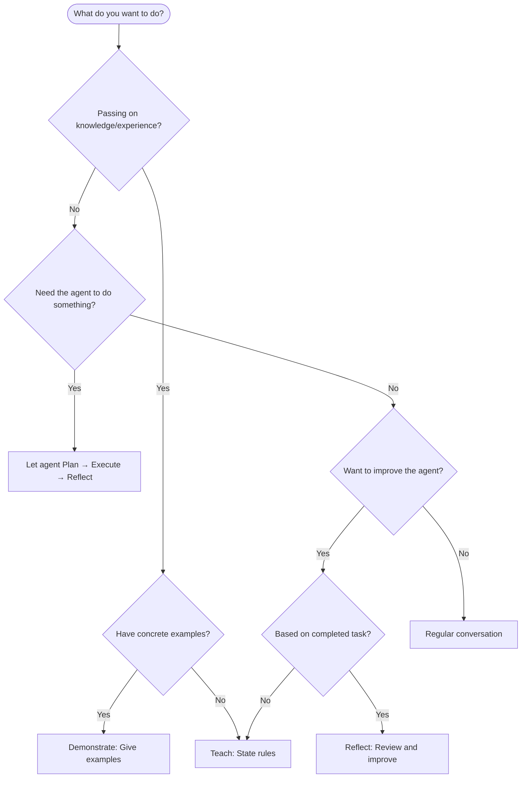

# Six Primitives Complete Guide

All interactions in DesireCore are built upon six fundamental primitives. Understanding them means mastering the core method of collaborating with your agent.

## Six Primitives Overview

| Primitive | Verb | Initiated By | Meaning |
|-----------|------|--------------|---------|
| **Teach** | Tell | You | Tell the agent what to do, why to do it, and what the exceptions are |
| **Demonstrate** | Show | You | Show the agent examples, counter-examples, and historical materials for it to imitate and generalize |
| **Clarify** | Ask | Agent | The agent actively asks for missing information to complete task conditions |
| **Plan** | Plan | Agent | The agent presents a plan, breaks down steps, and marks risk points and confirmation points |
| **Execute** | Do | Agent | Act within allowed permissions and boundaries, call tools, and advance the task |
| **Reflect** | Review | Agent | Submit receipts, review deviations, and write new experiences back to the behavior manual |

## Understanding the Six Primitives Through a Complete Scenario

Let's walk through how these six primitives work together using a real-world scenario—**teaching an agent to review procurement contracts**.

### Step 1: Teach—Tell It the Rules

First, you teach the agent the core rules for contract review:

```
You: "When reviewing procurement contracts, focus on the following points:
    1. Penalty fees cannot exceed 20% of the contract amount
    2. Payment terms cannot be less than 30 days
    3. Warranty period cannot be less than 12 months
    4. If it's imported equipment, there must be a clause about Chinese instruction manuals"
```

The agent will record these rules and form executable behavioral standards.

### Step 2: Demonstrate—Show It Examples

Rules alone aren't enough; you also show it a contract you've reviewed before:

```
You: "Let me show you a contract I reviewed before. Notice clause 8, which says
    'Penalty fee is 50% of the contract amount'—this is a typical high-risk clause.
    I marked it as 'strongly recommended for revision' and suggested changing it to 'not exceeding 20%'."
```

Through concrete examples, the agent learns not just "knowing the rules," but also "knowing how to apply the rules."

### Step 3: Clarify—It Asks Proactively

When you delegate a contract review task, the agent finds the information insufficient and asks proactively:

```
Agent: "I noticed this contract involves imported equipment but doesn't specify the country of origin.
        Questions:
        1. Are there different review standards for equipment from different countries?
        2. Do I need to additionally check export control related clauses?"
```

This is much better than silently doing the work and then handing you an incorrect result.

### Step 4: Plan—It Creates a Plan

After understanding the task, the agent presents you with an execution plan:

```
Agent: "I plan to review this contract in the following steps:

        1. [Deterministic] Check penalty fee percentage → Compare with 20% threshold
        2. [Deterministic] Check payment terms → Compare with 30-day minimum
        3. [Deterministic] Check warranty period → Compare with 12-month minimum
        4. [Adaptive] Analyze imported equipment related clauses
        5. [Adaptive] Comprehensive contract risk assessment
        6. [Human Gate] Generate review report, waiting for your confirmation before sending

        Proceed with this plan?"
```

:::info What are Deterministic, Adaptive, and Human Gate?
- **Deterministic Step**: Rules are clear, results are certain, executed like a program
- **Adaptive Step**: Requires AI understanding and judgment
- **Human Gate**: Key nodes that must be confirmed by you before continuing

See [Execution Monitoring](../04-delegation/03-execution-monitoring.md) for details.
:::

### Step 5: Execute—It Executes the Task

After you confirm the plan, the agent begins executing step by step. You can see the progress of each step in real time:

```
Agent:
  [Step 1/6] Checking penalty fee percentage...
  ✅ Clause 8: Penalty 15%, meets requirement

  [Step 2/6] Checking payment terms...
  ⚠️ Clause 5: Payment terms 15 days, below 30-day threshold, marked as risk

  [Step 3/6] Checking warranty period...
  ✅ Clause 12: Warranty 24 months, meets requirement

  [Step 4/6] Analyzing imported equipment clauses...
  ⚠️ Chinese instruction manual clause not found, recommended to add

  [Step 5/6] Comprehensive risk assessment...
  📊 Overall risk level: Medium (2 items need attention)

  [Step 6/6] Waiting for your confirmation of the review report...
```

### Step 6: Reflect—It Reviews and Summarizes

After task completion, the agent submits a receipt and reviews:

```
Agent: "Review complete. Receipt as follows:

        [Review Result Summary]
        - 2 risks: Payment terms too short, missing Chinese instruction manual clause
        - 4 compliant items
        - Recommended revisions to 2 clauses

        [Learning Takeaways]
        In this review, I noticed: In imported equipment contracts, the Chinese instruction manual clause
        is easily overlooked. I recommend elevating 'check Chinese instruction manual clause' to a deterministic
        step (automatic check) rather than an adaptive step.

        Should this experience be updated to the review rules?"
```

## The Cycle of Six Primitives

The six primitives are not one-time; they form a continuous optimization cycle:

```
  Teach → Demonstrate
    ↑           ↓
  Reflect ← Clarify
    ↑           ↓
  Execute ← Plan
```

Each cycle makes the agent more reliable. The more rules you teach and the richer the examples you provide, the stronger its ability to handle tasks becomes.

## When to Use Which Primitive



:::tip Small Tip
You don't need to deliberately "use" a specific primitive. Just express yourself naturally, like talking to a colleague. The agent will automatically recognize your intent. When you say "Remember to always do it this way," it knows you're "Teaching"; when you say "Look at this example," it knows you're "Demonstrating."
:::

## Deep Dive into Each Primitive

The following chapters will detail the most commonly used primitives:

- [Teaching Rules (Teach)](./03-teach-rules.md) — How to teach effective rules
- [Giving Examples (Demonstrate)](./04-demonstrate.md) — How to accelerate learning through examples
- [Learning Feedback](./05-learning-feedback.md) — How to confirm the agent learned correctly
- [Undo and Forget](./06-undo-forget.md) — How to correct incorrect learning
