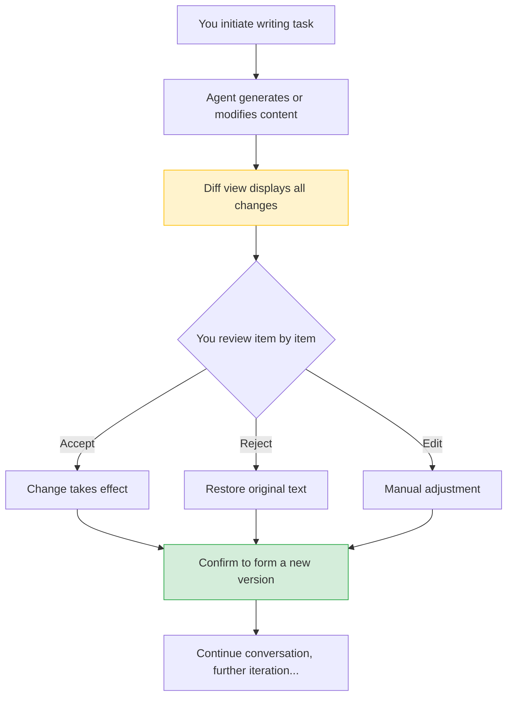

# What is Super Document

Have you used Code Review? After developers submit code, colleagues review it line by line, accepting or rejecting each change. **Super Document** brings this decades-proven collaboration mechanism to document writing—AI writes, you review.

## Core Concept: Review Documents Like Code Review

The problem with traditional AI writing tools is that AI gives you a large block of text, and you don't know what it changed or why. Accept or rewrite? You can only guess.

Super Document takes a completely different approach:

| Traditional AI Writing | Super Document |
|---|---|
| AI outputs an entire document, you find differences yourself | Every change made by AI is marked |
| Can only accept or rewrite entirely | Can accept, reject, or edit item by item |
| Don't know why AI made these changes | Each change comes with a reason |
| If it's wrong, start over from scratch | Complete version history, rollback anytime |

## Super Document vs. Regular Text Editing

Super Document is not just another Markdown editor. Its core value lies in **visualization and control of the modification process**:

- **Visible**: What changes AI made is clear at a glance
- **Controllable**: You decide what to accept and what to reject
- **Reversible**: Any operation can be undone, any version can be restored
- **Explainable**: AI doesn't just change, it tells you why

:::tip One Sentence Summary
If conversation is "verbal communication" between you and the Agent, then Super Document is your "written collaboration"—all changes are tracked, all decisions are traceable.
:::

## Use Cases

Super Document is suitable for any document work involving AI:

- **Daily Writing**: Emails, reports, proposals—let AI help you polish and improve
- **Professional Documents**: Contracts, bids, legal documents—AI assists with writing, you review and approve
- **Team Collaboration**: Documents with multiple contributors, track every change through version history
- **Knowledge Documentation**: Organize scattered ideas into structured documents

## Super Document Workflow at a Glance

> 💡 In the **Diff view**, red = deletion and green = addition, making every change clear at a glance.

Each round of changes is recorded as a version. You can return to any historical version at any time, just like Git history for code.

## Next Steps

- [Collaborative Writing](./02-collaborative-writing.md) — Learn how to write documents with Agents
- [Diff Visualization](./03-diff-view.md) — Understand how to use the modification comparison view
