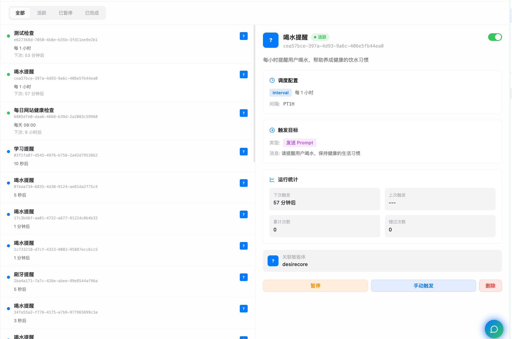
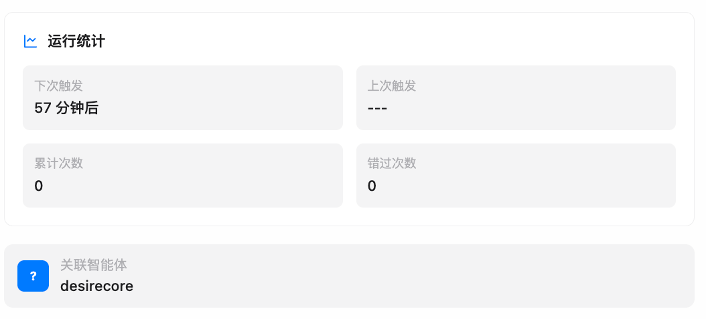
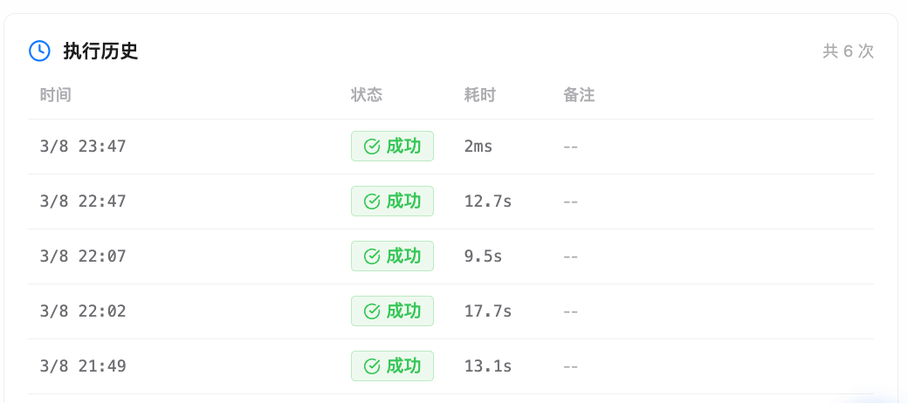

# Scheduled Tasks

Scheduled tasks let an agent run a clear instruction later or on a repeating schedule. They are useful for reminders, periodic summaries, recurring checks, automated reports, and other repeatable work that should run independently in the background.

Scheduled tasks are different from heartbeat monitoring and short waits:

| Capability | Best For | Execution Model |
|------------|----------|-----------------|
| Scheduled task | Run a clear prompt at a time | Background trigger starts a new run |
| Heartbeat monitoring | Inspect whether something needs attention | OK stays quiet; Alert notifies |
| Sleep | Wait briefly and continue the current task chain | Continues in the current conversation |

Use scheduled tasks for "generate a report every day at 9 AM." Use [Heartbeat Monitoring](./01-heartbeat.md) for "check every 30 minutes whether important mail arrived, but stay quiet when nothing changed." Use `Sleep` when the agent should wait a few seconds and continue the same task.

:::info Current context is not carried forward
`CreateSchedule` returns immediately after creating the task. When the time arrives, DesireCore starts a new run and sends the prompt. The scheduled run does not inherit temporary context from the current conversation, so the prompt should be self-contained.
:::

## Creation Methods

### Create Through Conversation

The most natural way is to tell the agent what to do and when:

```text
You: Give me a daily briefing of today's todos and schedule every morning at 8 AM.

Agent: I will create a daily briefing schedule:
       Name: Daily briefing
       Time: Every day at 08:00
       Action: Send a prompt to this agent
       Prompt: Summarize today's todos, schedule, and priorities.

You: Confirm.

Agent: The schedule has been created. It will run automatically at the scheduled time.
```

You do not need to memorize Cron or Duration syntax. The agent recognizes time-related intent in natural language and calls `CreateSchedule`.

Common trigger phrases include:

- "Remind me", "in X minutes", "every day", "every week", "every month"
- "Alarm", "countdown", "regularly", "schedule"
- Specific dates, exact times, or Cron-like periods

:::info Conversation is mainly for creation
Conversation creation is best for new tasks. To change an existing task, pause or delete it in the Automation panel and create a replacement. Advanced users can also update the schedule API or the `schedules/*.json` file. A normal chat is not guaranteed to locate and modify an old schedule reliably.
:::

### Create From The Automation Panel

Open the **Automation** panel from Explorer or an agent detail view, then click **Create**:

1. Choose the **target agent**, which will run the task at trigger time.
2. Enter a **schedule name** and optional **description**.
3. Choose a **trigger type**: interval, Cron expression, exact time, or delay.
4. Fill the trigger value, such as `PT1H`, `0 9 * * 1-5`, or `2026-05-04T15:00:00+08:00`.
5. Optionally set a **timezone**, such as `Asia/Shanghai`.
6. Enter the **prompt** that will be sent to the agent.
7. Optionally add **tags** for grouping and filtering.

The form is better than chat when you need precise Cron, timezone, or tag control. The regular Automation panel creation path primarily creates a `query` action, which sends a prompt to the target agent. Configure heartbeat monitoring from [Heartbeat Monitoring](./01-heartbeat.md) instead.

### Create From Templates

The Automation panel includes a **Templates** entry. A template pre-fills the name, description, and a common Cron expression. You choose the target agent, review the prompt, and confirm.

| Category | Description | Example Templates |
|----------|-------------|-------------------|
| Code quality | Automated code review and defect detection | Commit defect scan |
| Release | Release workflow automation | Weekly release notes, pre-tag check |
| Reports | Recurring work summaries | Standup Git summary, weekly update, PR team summary, skill suggestions |
| CI / testing | Continuous integration and test monitoring | CI failure summary, coverage gaps, CI root-cause grouping |
| Performance | Performance metric tracking | Performance regression detection |
| Dependencies | Dependency version and security maintenance | Dependency drift, dependency security upgrades |
| Documentation | Documentation maintenance | Documentation auto-update |
| Project management | Task and issue operations | Issue triage |
| Creative experiments | Creative or experimental automation | Classic mini-game |

Some templates do not include a default Cron expression because they are better suited to one-shot or on-demand work. Add the trigger rule in the creation form when using them.


## Trigger Types

The regular creation paths expose four time rules:

| Type | Use Case | Example |
|------|----------|---------|
| `at` | Trigger once at an exact time | `2026-05-04T15:00:00+08:00` |
| `delay` | Trigger once after a delay | `PT30M`, `30m` |
| `interval` | Repeat at a fixed interval | `PT1H`, `1h30m` |
| `cron` | Trigger on a calendar schedule | `0 9 * * 1-5` |

### Time Formats

- `at` uses an ISO 8601 date-time. Prefer including a timezone offset, such as `2026-05-04T15:00:00+08:00`.
- `delay` and `interval` accept ISO 8601 durations, such as `PT30M`, `PT1H`, and `P1D`, plus short forms such as `30s`, `5m`, `1h30m`, and `2d`.
- `cron` supports the common 5-field format: minute, hour, day, month, weekday. For example, `0 9 * * 1-5` means 9 AM on weekdays.

:::tip Selection advice
Use `at` or `delay` for one-shot tasks. Use `interval` for fixed spacing. Use `cron` for a fixed time of day, week, or month. If you are unsure, describe the schedule in natural language and let the agent choose the rule.
:::

### Advanced File/API Definitions

The AgentFS schedule definition can also represent advanced fields such as `starts_at`, `expires_at`, `max_fires`, `no_overlap`, and advanced recurrence rules through `rrule`. These are mainly for file-level or API-level configuration. Normal chat creation and the creation form should use the four trigger types above.

## Action

A normal scheduled task sends a prompt to the target agent. The agent handles it like a new task message, and the result appears in the relevant conversation, notification, or execution record.

| Action Type | Current Use | Notes |
|-------------|-------------|-------|
| `query` | Normal scheduled task | Sends a prompt to the target agent for reminders, summaries, reports, and independent checks |
| `heartbeat` | Low-level compatibility or specialized path | The schedule schema still keeps this action type; the recommended path is to manage heartbeat through heartbeat settings and `HEARTBEAT.md`, not to treat a normal scheduled task as a heartbeat substitute |

Write enough context into the prompt:

```text
Summarize GitHub notifications, important mail, and calendar conflicts added before 08:00 today.
If there is nothing that needs my action, return a short conclusion.
```

Scheduled tasks are best for independent work. When the work depends on temporary state in the current conversation, keep it in the current conversation or use `Sleep` for a short wait.

## Typical Scenarios

### Daily Briefing

```text
Summarize today's schedule and todos every morning at 8 AM.
```

At the scheduled time, the agent can inspect calendar events, organize todos, review important email, and generate a structured briefing.

### Recurring Checks And Summaries

```text
Check GitHub notifications and email every 30 minutes, then summarize new items that need my attention.
```

A scheduled task runs the prompt every time it fires and produces a result. If you want "stay quiet when nothing changed, notify only when something needs attention," use [Heartbeat Monitoring](./01-heartbeat.md), because heartbeat has explicit OK / Alert semantics.

### Delayed Reminder

```text
Remind me to join the meeting in 30 minutes.
```

This creates a one-shot `delay` task. After it fires, the task completes and does not repeat.

### Weekly Report

```text
Every Friday at 5 PM, remind me to write the weekly report and summarize this week's work.
```

The agent can review the week's conversations, tasks, pull requests, and decisions, then produce editable report material.

### Pre-Release Check

```text
Every Friday at 16:00, check the release branch tests, release notes, and migrations, then list blockers.
```

This is a good fit for Cron because it aligns to a fixed work rhythm. Put the review scope and output format directly in the prompt.

## Automation Panel

All scheduled tasks are managed in the **Automation** panel.



### Layout

- The header shows automation status, active count, paused count, and **Create** and **Templates** entries.
- The left list shows status dot, task name, schedule ID, agent, schedule rule, and next trigger time.
- The right detail panel shows configuration, trigger target, run statistics, execution history, tags, and associated agent.
- On narrow layouts, the detail area collapses and opens after you select a task.

### Filtering And Sorting

The panel provides status filters:

| Filter | Description |
|--------|-------------|
| All | Show every schedule |
| Active | Show tasks that are currently scheduling |
| Paused | Show tasks whose configuration is kept but will not fire |
| Completed | Show one-shot tasks that ended or tasks that reached max fire count |

The list is sorted by next trigger time in ascending order. Tasks with a next trigger time appear first, and sooner tasks appear higher.

## Task Details

Click a task in the list to view its full details:

| Area | Contents |
|------|----------|
| Basic info | Agent avatar, task name, current status, enable/pause toggle, schedule ID |
| Description | Purpose text entered when the task was created |
| Schedule config | Trigger type, readable rule, raw Cron or Interval value, timezone, missed-fire policy |
| Trigger target | Action type and prompt content |
| Run stats | Next trigger, last trigger, total run count, missed count |
| Execution history | Recent fire records with pagination |
| Tags | Labels for grouping |
| Associated agent | Agent that will actually run the task |



## Managing Tasks

### Pause And Resume

Pause a task when you want it to stop firing without deleting its configuration or history.

| Action | Description |
|--------|-------------|
| Pause | Stop future scheduling while keeping the task file |
| Resume | Continue scheduling with the same rule |

Only `active` and `paused` tasks can be toggled directly.

### Trigger Now

Click **Trigger Now** to run the current task once without waiting for the next scheduled time. Manual triggers do not change the schedule rule, and the run is still written to execution history.

### Delete

Delete tasks you no longer need. The detail panel uses two-step confirmation: click delete once to enter confirmation state, then click again within 5 seconds to delete. Deleting removes the corresponding `schedules/*.json` file.

## Lifecycle

Schedule definitions contain `enabled` and `status`. Common statuses are:

| Status | Description |
|--------|-------------|
| `pending` | Created but not yet inside its active window |
| `active` | Scheduling normally |
| `paused` | Paused and will not fire |
| `completed` | One-shot task ended or max fire count reached |
| `cancelled` | Cancelled or deleted |

Finer lifecycle control is available through files or the API:

| Control | Description |
|---------|-------------|
| `starts_at` | Do not fire before this time even if the rule matches |
| `expires_at` | Stop automatically after this time |
| `max_fires` | Complete automatically after this many fires |
| `no_overlap` | Skip a fire if the previous execution is still running |

## Timezones

The scheduler supports IANA timezones. You can set `Asia/Shanghai`, `America/New_York`, or another timezone on a task, and Cron or exact-time calculations will respect it.

If no timezone is set, DesireCore uses the operating system timezone. For cross-timezone work, write the timezone explicitly in the prompt or form so "9 AM" is not interpreted differently on another machine.

## Missed Fires

When the app is closed, the computer sleeps, or the scheduler is not running, expected trigger times can be missed. On startup, the scheduler detects missed `interval` tasks and uses `missed_fire_policy` to decide whether to compensate.

| Policy | Description | Best For |
|--------|-------------|----------|
| `skip` | Ignore missed fires and wait for the next one | Checks or reminders that only care about the latest state |
| `fire_once` | Run one compensation for the most recent missed fire | Daily reports or syncs that should not be fully missed |
| `fire_all` | Queue compensation runs for missed fires, with safety limits | Tasks where each fire represents a separate work item |

Compensation runs are written to execution history so you can distinguish them from normal triggers. `fire_once` is rate-limited during startup, and `fire_all` limits both the number of compensation tasks per schedule and how many agents can compensate concurrently.

Set `missed_fire_policy` explicitly when the missed-fire behavior matters. If it is not set, the scheduler uses its default handling.

## Execution Records

Each trigger writes a history record. Records usually include:

- Scheduled time and actual fired time
- Whether it was a missed-fire compensation, and which policy applied
- Result: success, failure, or skipped
- Error reason
- Duration
- Fire count

Execution history is paginated in task details. The API returns 20 records by default and at most 100 per page; the UI displays 5 records per page for compact browsing in the detail panel.



If execution fails, DesireCore records the error. A periodic schedule keeps its configuration after a single failure; transient errors enter backoff, while persistent or unrecoverable failures may pause the schedule to avoid repeated failures.

## Scheduling And Notifications

A normal scheduled task runs through this flow:

1. The scheduler fires the task at the planned time.
2. The executor emits a `query` action.
3. The target agent receives the prompt and starts a new run.
4. The result appears in the relevant conversation, notification, or execution record.
5. State changes are synced to the interface through the realtime channel.

Notification behavior depends on the task result and the agent output. For strict "do not disturb unless something changed" behavior, use heartbeat monitoring instead of writing a normal scheduled task as a quiet polling loop.

## File Location

Each schedule is stored as a JSON file in the agent repository:

```text
~/.desirecore/agents/<agent_id>/schedules/<schedule_id>.json
```

These files are part of AgentFS. You can inspect them in the file explorer, and their changes are tracked through the agent's Git history. After editing a file directly, reload that agent's schedule configuration.
