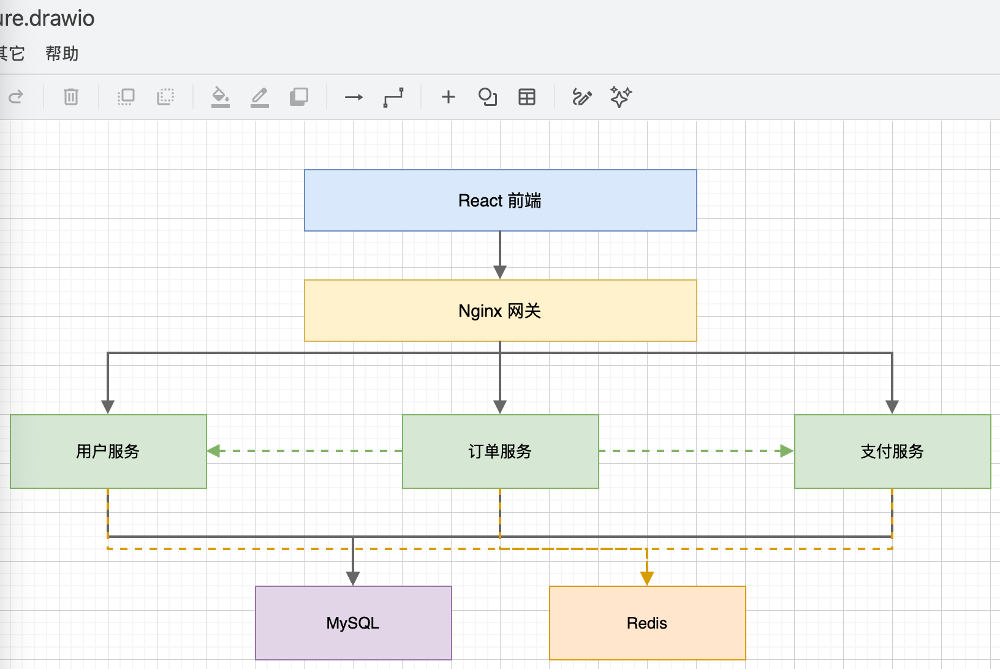

# AI-Powered Automatic Flowchart Generation

## Real Workflow

The flowchart scenario works because: logic already exists—it's just hidden in text, meeting discussions or code, causing different roles to have inconsistent understanding.

| Dimension | Real Situation |
|-----------|----------------|
| Trigger Point | PRD review, SOP creation, technical proposal review, API integration alignment |
| Existing Materials | Verbal processes, PRD paragraphs, SOP documents, API specifications, code call chains |
| Pain Point | Branches, exception paths and role boundaries unclear; manual drawing consumes lots of time |
| DesireCore Intervention | First extract process structure, then generate flowcharts, swimlane diagrams, sequence diagrams or architecture diagrams, and adjust based on feedback |
| Acceptance Result | Team gets a diagram usable for review and discussion, focusing on logic review rather than dragging nodes |

---

## What It Can Do

### 📝 Natural Language Input

- **Conversational Descriptions**: "After user places an order, check inventory first. If in stock, generate the order; if out of stock, show out-of-stock alert"
- **Document Parsing**: Upload PRD / SOP documents to automatically extract process logic
- **Code Analysis**: Read code files to generate function call flowcharts

### 🎨 Intelligent Chart Generation

- **Flowcharts**: Standard Flowchart, supporting decisions, loops, parallel branches
- **Sequence Diagrams**: System interactions, API call sequences
- **Architecture Diagrams**: System architecture, deployment topology
- **Swimlane Diagrams**: Cross-department/role business processes
- **Mind Maps**: Hierarchical structures, knowledge organization

### 🔧 Flexible Adjustments

- **Natural Language Modifications**: "Change the approval node to two-level approval"
- **Style Customization**: Color schemes, node shapes, connector styles
- **Layout Optimization**: Auto-alignment, spacing adjustment, direction switching

### 📤 Multi-Format Export

- **Image Formats**: PNG, SVG, PDF
- **Editable Formats**: Mermaid code, draw.io XML, Visio
- **Online Sharing**: Generate shareable links with collaborative editing support

---

## Workflow Control Points

| Stage | Details to Confirm |
|-------|-------------------|
| Input Clarification | First confirm process boundaries: where it starts, where it ends, who participates |
| Node Extraction | Separate actions, decisions, waits and exception handling into different nodes, don't mix into one sentence |
| Role Separation | For cross-department processes, prefer swimlane diagrams, clarify which role owns each node |
| Branch Review | Focus on checking "No", "Exception", "Timeout", "Rejection" paths are complete |
| Style Output | Only adjust layout, colors and export format after logic is confirmed |
| Future Maintenance | Save editable formats together, avoid having to redraw next time |

---

## Typical Use Cases

### Scenario 1: Product Requirements Flowchart

```
📁 Input
    └── User description: "Draw an e-commerce return process: user applies for return,
        customer service reviews, after approval user ships item back, warehouse inspects,
        if inspection passes then refund, if not then reject the return"

⬇️ Agent processing (approx. 10 seconds)

📊 Output: Return_Process.png
    ┌─────────┐
    │ User    │
    │ Applies │
    │ Return  │
    └────┬────┘
         ↓
    ┌─────────┐
    │ Customer│
    │ Service │
    │ Review  │
    └────┬────┘
         ↓
    ◇ Review ◇───No──→ 【Return Rejected】
         │Yes
         ↓
    ┌─────────┐
    │ User    │
    │ Ships   │
    │ Item    │
    └────┬────┘
         ↓
    ┌─────────┐
    │ Warehouse│
    │ Inspection│
    └────┬────┘
         ↓
    ◇ Inspection ◇───No──→ 【Return Rejected】
         │Yes
         ↓
    ┌─────────┐
    │ Refund  │
    │ Complete│
    └─────────┘
```

### Scenario 2: Technical Architecture Diagram

```
📁 Input
    └── User description: "Draw a microservices architecture diagram including:
        Frontend React, Gateway Nginx,
        User Service, Order Service, Payment Service,
        Database using MySQL and Redis"

⬇️ Agent processing (approx. 15 seconds)

📊 Output: Microservices_Architecture.draw.io


```


### Scenario 3: Extract Process from Document

```
📁 Input
    ├── Employee_Onboarding_SOP.docx (3 pages of text description)
    └── User instruction: "Extract onboarding process and generate a swimlane diagram"

⬇️ Agent processing (approx. 30 seconds)

📊 Output: Onboarding_Process_Swimlane.png

    HR          │  IT Dept     │  Hiring Dept  │  New Employee
    ────────────┼──────────────┼───────────────┼─────────────
    Send Offer  │              │               │
        ↓       │              │               │
    Prepare     │              │               │ Confirm
    Contract    │              │               │ Onboarding
        ↓       │              │               │     ↓
    Onboarding ─┼→ Account ────┼→ Assign ──────┼→ Report
    Register    │   Setup      │   Workspace   │     ↓
        ↓       │      ↓       │      ↓        │     ↓
    Social      │  Distribute  │  Introduce    │  Onboarding
    Insurance   │  Equipment   │  Team         │  Training
        ↓       │              │               │     ↓
    Archive     │              │               │  Probation
                │              │               │  Starts
```

---

## Efficiency Comparison

| Metric | Manual Drawing (Visio/draw.io) | AI Agent |
|--------|--------------------------------|----------|
| Simple flowchart (5-10 nodes) | Manual drag, connect, align | Suitable for quick initial generation |
| Complex flowchart (20+ nodes) | High modification and alignment cost | Suitable for confirming structure first, then multi-round adjustment |
| Modification & Adjustment | Manual drag | Natural language description |
| Style Uniformity | Manual setup required | Can apply templates |
| Format Conversion | Export one by one | One-click multi-format |
| Learning Curve | Need to learn drawing tool | Mainly through description and review