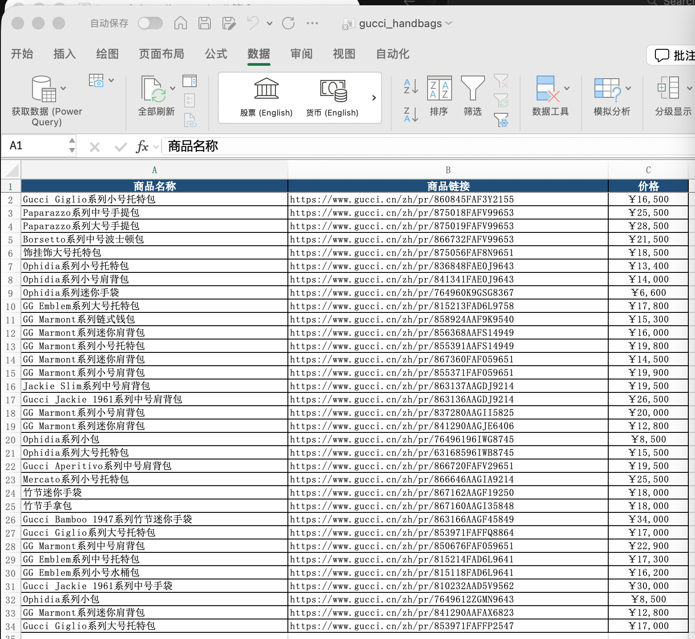

# AI-Powered Web Data Collection

## Pain Points

Market research requires monitoring competitor prices, operations teams need to collect industry news, and sales teams need to organize publicly available client information — every day spent switching between different websites, copying and pasting, and formatting. Traditional web scrapers require writing code and maintaining scripts; a single website redesign breaks them. Manual collection is inefficient and prone to missing key information.

This use case makes an AI agent your data collection assistant. Just tell it "where to collect what," and it automatically completes web browsing, information extraction, and data organization, outputting structured results.

---

## What It Can Do

### 🌐 Intelligent Web Browsing

- **Multi-Page Parallel**: Open multiple web pages simultaneously for batch collection
- **Dynamic Content Handling**: Supports JavaScript-rendered pages, waits for content loading
- **Login State Preservation**: Supports Cookie management for content requiring login
- **Anti-Scraping Countermeasures**: Intelligent access frequency control, simulating human browsing behavior

### 🎯 Precise Information Extraction

- **Natural Language Instructions**: "Extract product names, prices, and ratings from this page"
- **Table Data Recognition**: Automatically identifies web tables and fully extracts row and column data
- **List Content Collection**: News lists, product lists, search results — all batch collected
- **Nested Data Processing**: Detail page links automatically followed for complete information collection

### 📋 Structured Output

- **Excel / CSV Export**: Standard table format for subsequent analysis
- **JSON Format**: Integration with databases or other systems
- **Custom Templates**: Define output fields and formats on demand
- **Incremental Updates**: Compare with historical data, output only changes

### 🔄 Scheduled Tasks

- **Periodic Collection**: Execute automatically daily or weekly
- **Change Monitoring**: Real-time alerts for price changes and content updates
- **History Records**: Retain collection history for trend analysis

---

## Typical Use Cases

### Scenario 1: Official Website Product Collection

File location: ./assets/web-scraping/gucci_handbags.xlsx

```
📁 Input
    ├── Target website: gucci.cn (Gucci China official site)
    ├── Collection scope: All products in handbags category
    └── User instruction: "Collect names, prices, and links for all handbags on Gucci official site"

⬇️ Agent processing (approx. 3-5 minutes)

📊 Output: gucci_handbags.xlsx (33 products)
    ├── Product Name
    │   ├── Gucci Giglio Small Tote Bag
    │   ├── Paparazzo Medium Top Handle Bag
    │   ├── Gucci Jackie 1961 Medium Shoulder Bag
    │   └── ... 33 styles total
    ├── Product Link
    │   └── Official detail page URL for each product
    └── Price
        ├── Price range: ¥6,600 ~ ¥30,000
        └── Structured data ready for comparison analysis
```

### Scenario 2: Industry News Aggregation

```
📁 Input
    ├── Industry media websites (10 sites)
    ├── Keyword filtering rules
    └── User instruction: "Collect today's AI industry news, sorted by importance"

⬇️ Agent processing (approx. 5-8 minutes)

📊 Output
    ├── Today_News_Summary.md
    │   ├── Top 10 Important News (with summaries)
    │   ├── Organized by topic
    │   └── Original article links
    ├── Keyword word cloud chart
    └── RSS feed (importable into readers)
```

### Scenario 3: Company Information Collection

```
📁 Input
    ├── Target company list (50 companies)
    └── User instruction: "Collect basic information, funding status, and main products for these companies"

⬇️ Agent processing (approx. 15-20 minutes)

📊 Output
    ├── Company_Information_Database.xlsx
    │   ├── Company name, founding date, registered capital
    │   ├── Funding rounds, investors, funding amounts
    │   ├── Main business, core products
    │   └── Official website, contact information
    ├── Company profile cards (PDF)
    └── Data source annotations
```

### Scenario 4: Job Recruitment Aggregation

```
📁 Input
    ├── Recruitment platforms (3 platforms)
    ├── Job keywords, city, salary range
    └── User instruction: "Find qualified Product Manager positions"

⬇️ Agent processing (approx. 8-10 minutes)

📊 Output
    ├── Job_Listing.xlsx
    │   ├── Company, position, salary, requirements
    │   ├── Post date, application link
    │   └── Match score
    └── Salary distribution analysis chart
```

---

## Efficiency Comparison

| Metric | Manual Collection | Traditional Web Scraper | AI Agent |
|--------|-------------------|-------------------------|----------|
| Collect 100 data points | ~2 hours | ~5 minutes (after development) | ~10 minutes |
| Technical Barrier | None | High (requires programming) | Low (natural language) |
| Website Adaptation Cost | None | High (code per site) | Low (auto-adaptation) |
| Maintenance Cost | Continuous labor | High (updates needed on redesign) | Low (intelligent handling) |
| Unstructured Content | Handleable | Difficult | Strong |
| Compliance | Human judgment | Requires configuration | Built-in frequency control |

---

## Usage Notes

⚠️ **Compliance Reminder**:
- Please comply with target website's robots.txt and terms of use
- Control collection frequency to avoid burdening target websites
- Only collect publicly accessible information
- Collected data is for internal analysis use only; ensure data privacy compliance
