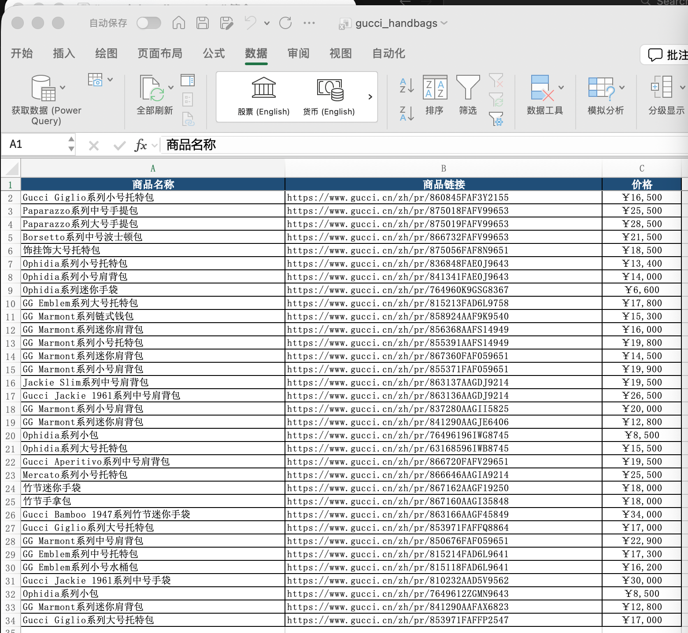

# AI-Powered Web Data Collection

## Real Workflow

Web data collection scenarios are typically not long-running, stable large-scale scrapers, but rather temporary, low-frequency information gathering tasks where fields frequently change.

| Dimension | Real Situation |
|-----------|----------------|
| Trigger Point | Competitor research, job posting aggregation, public company information collection, industry news gathering |
| Existing Materials | Target URLs, field requirements, filtering criteria, historical spreadsheets or output templates |
| Pain Point | Website structures are inconsistent, manual copying easily misses fields, developing traditional scrapers isn't cost-effective |
| DesireCore Intervention | Web Data Collection agent browses pages, extracts fields, preserves source links and outputs tables |
| Acceptance Result | User receives a verifiable data table, then confirms collection scope and data usage per compliance requirements |

## Recommended Agent

**Web Data Collection Agent** — Handles competitor pricing monitoring, public company information gathering, industry news aggregation, and other web browsing and data extraction tasks. Uses natural language instructions to specify collection targets and output formats.

## Work Flow Control Points

| Stage | Details to Confirm |
|-------|-------------------|
| Scope Confirmation | Target website, sections, page count, fields, and filtering criteria are clearly defined |
| Compliance Check | Whether collection is allowed; whether login state, personal information, copyright content, or prohibited terms are involved |
| Extraction Rules | Field names, price units, date formats, handling of missing values, and whether to preserve source links |
| Data Cleaning | Deduplication, standardization, abnormal prices, empty fields, and duplicate products are handled |
| Output Validation | Spot-check several records to confirm no field misalignment or omissions |
| Ongoing Maintenance | Re-calibrate rules when page structures change; preserve collection logs for scheduled tasks |

## DesireCore Capabilities Used

- **Desktop Automation / GUI Control**: Browse pages through the browser, perform screenshot recognition and form interactions when needed
- **Scheduled Inspection**: Periodically check for changes in prices, announcements, job postings, etc.; notify only when changes occur
- **Security Audit**: Preserve collection sources, execution records, and output files for traceability

## Typical Use Cases

### Scenario 1: Official Website Product Collection

File location: ./assets/web-scraping/gucci_handbags.xlsx

```
📁 Input
    ├── Target website: gucci.cn (Gucci China official site)
    ├── Collection scope: All products in handbags category
    └── User instruction: "Collect names, prices, and links for all handbags on Gucci official site"

⬇️ Agent processing

📊 Output: gucci_handbags.xlsx (33 products)
    ├── Product Name
    │   ├── Gucci Giglio Small Tote Bag
    │   ├── Paparazzo Medium Top Handle Bag
    │   ├── Gucci Jackie 1961 Medium Shoulder Bag
    │   └── ... 33 styles total
    ├── Product Link
    │   └── Official detail page URL for each product
    └── Price
        ├── Price range: ¥6,600 ~ ¥30,000
        └── Structured data ready for comparison analysis
```

### Scenario 2: Industry News Aggregation

```
📁 Input
    ├── Industry media websites (10 sites)
    ├── Keyword filtering rules
    └── User instruction: "Collect today's AI industry news, sorted by importance"

⬇️ Agent processing

📊 Output
    ├── Today_News_Summary.md
    │   ├── Top 10 Important News (with summaries)
    │   ├── Organized by topic
    │   └── Original article links
    ├── Keyword word cloud chart
    └── RSS feed (importable into readers)
```

### Scenario 3: Company Information Collection

```
📁 Input
    ├── Target company list (50 companies)
    └── User instruction: "Collect basic information, funding status, and main products for these companies"

⬇️ Agent processing

📊 Output
    ├── Company_Information_Database.xlsx
    │   ├── Company name, founding date, registered capital
    │   ├── Funding rounds, investors, funding amounts
    │   ├── Main business, core products
    │   └── Official website, contact information
    ├── Company profile cards (PDF)
    └── Data source annotations
```

### Scenario 4: Job Recruitment Aggregation

```
📁 Input
    ├── Recruitment platforms (3 platforms)
    ├── Job keywords, city, salary range
    └── User instruction: "Find qualified Product Manager positions"

⬇️ Agent processing

📊 Output
    ├── Job_Listing.xlsx
    │   ├── Company, position, salary, requirements
    │   ├── Post date, application link
    │   └── Match score
    └── Salary distribution analysis chart
```

## Key Steps

1. **Define Collection Scope** — Specify target website, page sections, number of pages, fields to extract, and filtering criteria; the more specific, the more accurate the results
2. **Compliance Review** — Before collection begins, confirm that the target website's terms of use and robots.txt permit automated access; for data involving personal information or copyright, verify authorization first
3. **Set Extraction Rules** — Define field names, units, date formats, and how to handle missing values; request source link preservation for later verification
4. **Data Cleaning and Validation** — After collection, deduplicate, standardize formats, handle outliers and empty fields; spot-check several records to confirm field accuracy
5. **Automated Maintenance** — For periodic collection needs, set up scheduled tasks and preserve collection logs; re-calibrate extraction rules when page structure changes

## Efficiency Comparison

| Metric | Manual Collection | Traditional Web Scraper | AI Agent |
|--------|-------------------|-------------------------|----------|
| Collect 100 data points | Time-consuming, easily misses items | Fast after development complete | Suited for temporary or frequently-changing collection tasks |
| Technical Barrier | None | High (requires programming) | Low (natural language) |
| Website Adaptation Cost | None | High (code per site) | Adjustable through field descriptions |
| Maintenance Cost | Continuous labor | High (site redesign requires updates) | Requires re-calibration per page changes |
| Unstructured Content | Handleable | Difficult | Strong |
| Compliance | Human judgment | Requires configuration | Still requires user confirmation of site terms and data usage |

## Final Deliverable

A structured data table with traceable source links, covering all fields specified in your requirements. You can continue asking the agent to filter, analyze, visualize, or export the data in other formats.

:::warning Compliance Reminder
- Comply with the target website's robots.txt and terms of use
- Control collection frequency to avoid burdening target websites
- Only collect publicly accessible information
- For data involving personal information, account content, or copyright-protected content, confirm authorization and data usage scope first
:::
