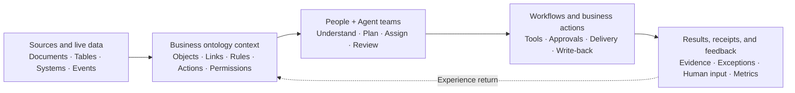

# Enterprise Business Ontology and AI Deployment

The central problem in enterprise AI is usually not that the model lacks a particular term. It lacks a stable business context: which object is being handled, what state it is in, which rules apply, which actions are available, and when a person must take responsibility.

An **Enterprise Business Ontology** organizes objects, relationships, rules, actions, and permissions into a shared model so people and agents can understand, judge, and collaborate against the same operational world.

:::info Capability boundary
This page describes an **ontology-driven implementation method**. DesireCore uses AgentFS, memory and knowledge graphs, Skills, Workflows, multi-agent teams, Hooks / Policies, approvals, and receipts to carry the related assets and execution. It does not describe these capabilities as a separate, closed “ontology engine.” Data connections, automated actions, and enterprise governance depend on the current release, authorized scope, and formal solution design.
:::

## An ontology is not a glossary

A glossary explains what a term means. An operational business ontology for AI must answer four kinds of questions:

| Element | Question | Example |
|---|---|---|
| **Objects and state** | What exists in the business world, and what state is it in? | Asset A, contract v3, pending order |
| **Links and evidence** | How are objects related, and where did a conclusion come from? | Owner, upstream dependency, cited standard, source page |
| **Rules and logic** | How should a judgment be made, and which constraints apply? | Approval threshold, review rule, decision tree, calculation |
| **Actions and governance** | What may happen, who confirms it, and how is it recorded? | Generate report, submit review, write back, Human Gate |

A useful shorthand is:

> Semantics enables understanding, logic enables judgment, actions enable execution, and permissions plus evidence enable trust.

## The loop from data to action

The business ontology sits between data, knowledge, and execution. It does not replace databases, ERP, CRM, document repositories, or professional systems. It gives information from those systems a consistent meaning and connects it to business action within an authorized scope.

Two constraints apply throughout the loop:

1. **The ontology must remain connected to real sources.** Object state, rules, and evidence need to trace to specific data, document revisions, or systems of record.
2. **Actions remain governed.** Understanding an object does not grant permission to modify it. Execution still follows tool grants, file scopes, policy, Human Gates, and audit.

## Ontology, knowledge graphs, and RAG

These capabilities work well together, but they are not interchangeable.

| Capability | Core question | Typical output | Boundary when used alone |
|---|---|---|---|
| **RAG / Semantic Retrieval** | Which material is relevant now? | Chunks, citations, summaries | Finds information but does not inherently model complete business state or permitted action |
| **Knowledge Graph** | Which entities exist, and how are they linked? | Entities, relationships, paths, sources | Expresses relationships but may not include process, policy, or action semantics |
| **Business Ontology** | How is the business world defined, judged, and changed? | Objects, links, rules, actions, permissions | Must be maintained with real data, systems, and frontline workflows |
| **Agent Workflow** | How is a goal completed through tasks? | Plans, tool calls, deliverables, receipts | Without shared semantics, cross-system understanding and governance fragment easily |

In combination:

- RAG supplies relevant material;
- the knowledge graph supplies relationships and provenance;
- the business ontology supplies stable meaning, rules, and action boundaries;
- agents plan, collaborate, and execute toward a goal.

## How DesireCore capabilities support the method

DesireCore does not require ontology assets to be placed in another opaque system. They can live in existing, inspectable capabilities.

| DesireCore capability | Role in an ontology implementation | Inspectable asset or evidence |
|---|---|---|
| [AgentFS](./agentfs) | Store identity, rules, sources, Skills, Workflows, versions, and receipts | Files, directories, Git versions, provenance |
| Memory and knowledge graphs | Connect terminology, object relationships, corrections, and task experience | Memory entries, scopes, links, sources |
| Skills / Decision Trees | Carry expert rules, examples, judgment paths, and acceptance criteria | `SKILL.md`, scripts, rules, test material |
| Workflow | Combine deterministic steps, agent judgment, tools, and exception handling | Node configuration, traces, retries, replay |
| Multi-Agent Runtime | Let research, execution, and review roles share meaning and divide work | Delegation, member output, merge and review results |
| Hook / Policy / Human Gate | Constrain high-risk action and system write-back | Policy decisions, approvals, denial, temporary grants |
| [Receipt System](./receipt-system) | Record which information, rules, and actions were used | Inputs, outputs, tool calls, evidence, exceptions |

:::warning Do not document a method as a product capability that does not exist
When a project uses files, memory, Skills, and Workflows to organize business context, describe that composition accurately. A dedicated ontology platform should only be claimed after the corresponding data model, editor, query surface, or runtime has actually been implemented.
:::

## FDE-style delivery: start with a minimum viable ontology

An FDE (Forward Deployed Engineer) approach works at the operational edge with domain experts to model, integrate, and validate. It does not begin by building a complete ontology for the entire enterprise. It starts with one valuable business chain.

### 1. Work at the operational edge

**Core question:** Who makes which decision under what conditions?

- Shadow a real task instead of documenting only the ideal process;
- map roles, inputs, outputs, systems, exception paths, and risk boundaries;
- record current time, error types, human takeover, and business outcomes.

**Stage output:** workflow map, ownership, inputs and outputs, baseline metrics.

### 2. Model the minimum viable ontology

**Core question:** Which concepts are essential to complete this business chain?

- Define critical objects, relationships, and state;
- collect expert rules, priorities, exceptions, and acceptance criteria;
- list permitted actions, policy conditions, and evidence requirements.

**Stage output:** object dictionary, relationship map, rule inventory, action and policy table.

### 3. Assemble the agent work loop

**Core question:** How does shared meaning enter real execution?

- Organize sources, rules, and role boundaries in AgentFS;
- carry judgment and steps through Skills, decision trees, and Workflows;
- connect required tools and define Human Gates, exception handling, and write-back boundaries;
- define responsibilities, handoffs, and review relationships across agents.

**Stage output:** runnable scenario, role split, approval gates, delivery templates.

### 4. Evaluate, release, and iterate

**Core question:** How do we prove value and widen automation safely?

- Use real test sets, boundary cases, and failure categories;
- check object recognition, rule decisions, delivery quality, and reviewer variance;
- observe policy decisions, human takeover, cost, latency, and business results;
- update ontology assets through replay, receipts, and version comparison.

**Stage output:** acceptance report, evaluation baseline, operations dashboard, iteration plan.

## Scenario modeling examples

### AI proposal writing

| Dimension | Example |
|---|---|
| Objects | Tender requirements, qualifications, scoring criteria, corporate evidence, chapters, risks |
| Links | Scoring criterion to chapter, qualification to evidence, conclusion to source page |
| Rules | Coverage, qualification fit, format, prohibited claims |
| Actions | Decompose, match evidence, draft in parallel, review risk, deliver Word |
| Human boundary | Commitments, pricing, qualifications, and the final submission require accountable human confirmation |

### Engineering drawing review

| Dimension | Example |
|---|---|
| Objects | Equipment, lines, instruments, loops, sheets, coordinates, revisions, review rules |
| Links | Topology, loop ownership, cross-sheet references, objects to evidence locations |
| Rules | Identifier consistency, topology checks, professional rules, frozen baselines |
| Actions | Recognize, link, compare, produce issue lists and evidence locations |
| Human boundary | Baselines must be frozen first; qualified engineers review and sign off findings |

### Contract review and obligation tracking

| Dimension | Example |
|---|---|
| Objects | Contracts, clauses, parties, obligations, deadlines, amounts, risks, approvals |
| Links | Party to obligation, clause to regulation, risk to approver |
| Rules | Corporate templates, legal requirements, thresholds, missing and conflicting clauses |
| Actions | Review clauses, cite evidence, grade risk, route approval, generate reports |
| Human boundary | Legal judgment, material risk acceptance, and signature remain with authorized people |

## Governance and acceptance checklist

Production acceptance should not only evaluate whether the model “sounds right.” It should cover at least four evidence classes.

### Semantics and evidence

- [ ] Objects, relationships, and state definitions are confirmed by domain experts
- [ ] Ambiguous terminology, field conflicts, and revision differences have explicit handling
- [ ] Critical conclusions trace to a source, revision, page, or coordinate

### Task and quality

- [ ] Test sets include normal cases, boundary cases, and counterexamples
- [ ] Delivery format, business rules, and professional requirements can be checked
- [ ] Differences between AI output and professional review are recorded and classified

### Action and permission

- [ ] Tools, files, data, and write-back follow least privilege
- [ ] High-risk action enters a [Human Gate](./step-types)
- [ ] Dangerous operations can be denied, and sensitive information can be restricted or masked

### Operations and improvement

- [ ] Every run preserves receipts, exceptions, and human takeover
- [ ] Pass rate, failure rate, cost, latency, and business outcomes are monitored
- [ ] Ontology, Skill, and Workflow changes are controlled through versions and evaluation

## Common misconceptions

### “We have a knowledge base, so we already have an ontology”

A knowledge base supplies material. It does not necessarily define object state, business rules, or executable actions. A business ontology exists when people and agents can judge and act against the same governed meaning.

### “The larger the ontology, the better”

A large model that has not been validated in live work becomes stale easily. A more reliable approach builds a minimum ontology around one outcome, closes the feedback loop, and then expands.

### “Once we have an ontology, agents can decide everything automatically”

An ontology clarifies decision context. It does not remove risk, professional accountability, or permission constraints. High-risk engineering, legal, and financial conclusions still require qualified and authorized people.

## Industry references

- [W3C OWL 2 Overview](https://www.w3.org/TR/owl2-overview/): standards foundation for ontology languages, classes, properties, individuals, and relationships.
- [Palantir Ontology Overview](https://www.palantir.com/docs/foundry/ontology/overview): public explanation of connecting objects, links, actions, functions, and governance to operations.
- [Palantir AI FDE Overview](https://www.palantir.com/docs/foundry/ai-fde/overview): public workflow for using natural language across data integration, ontology editing, functions, governance, and validation.

These references explain industry methods and do not imply any product affiliation between DesireCore and the publishers.

## Related documentation

- [AgentFS](./agentfs)
- [Task Orchestration](./task-orchestration)
- [Agent Permission Boundaries](./agent-permission-boundary)
- [Hardened, Flexible, and Human-Gate Steps](./step-types)
- [Receipt System](./receipt-system)
- [Enterprise Service Coordination](/use-cases/solutions/enterprise-coordination)
